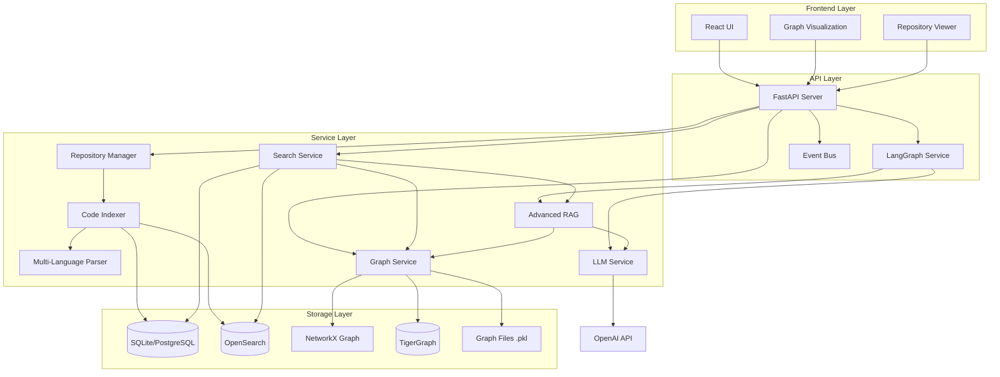
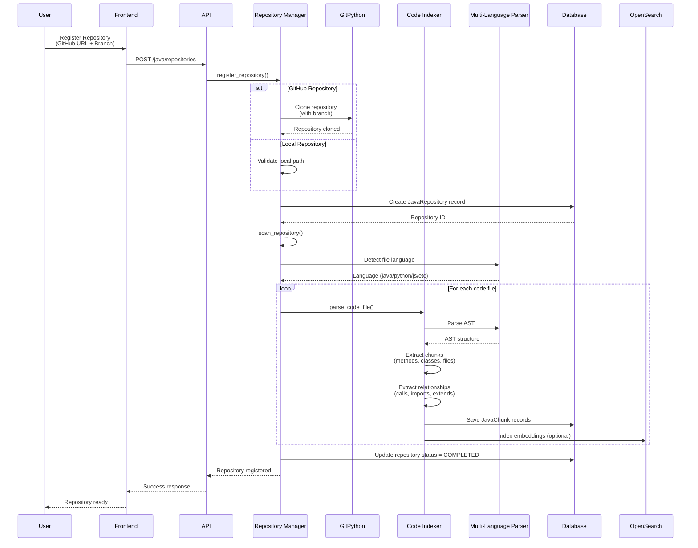
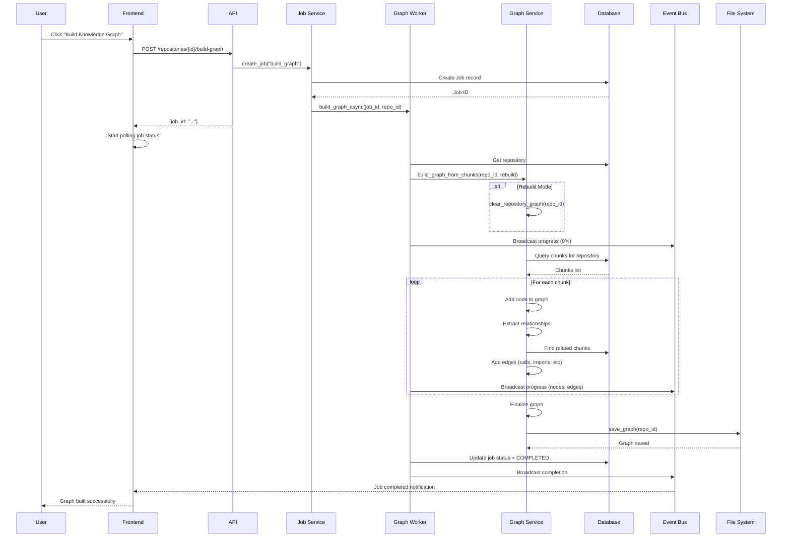
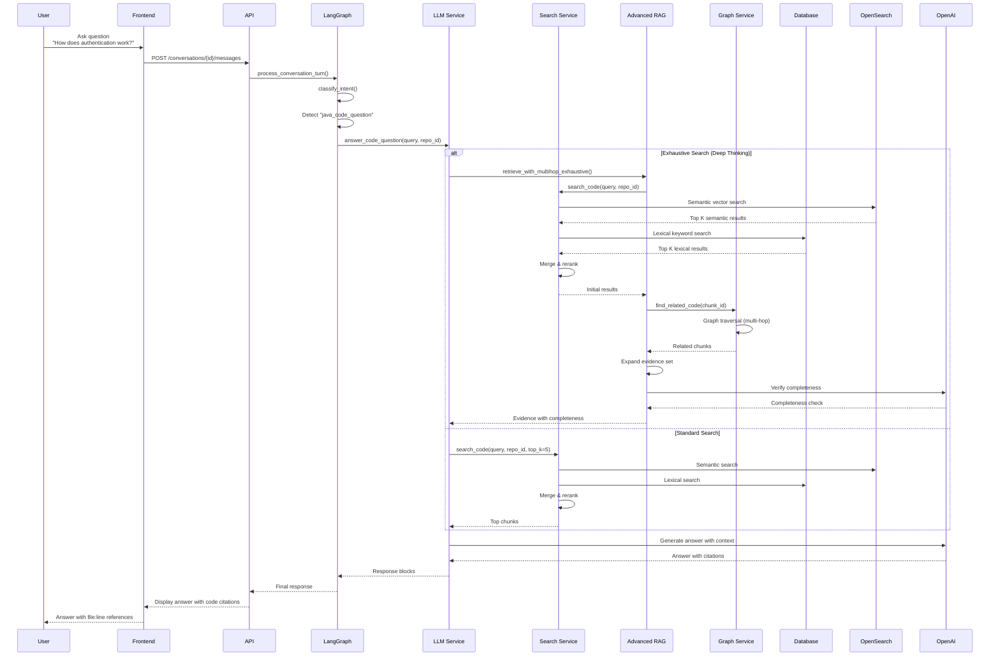
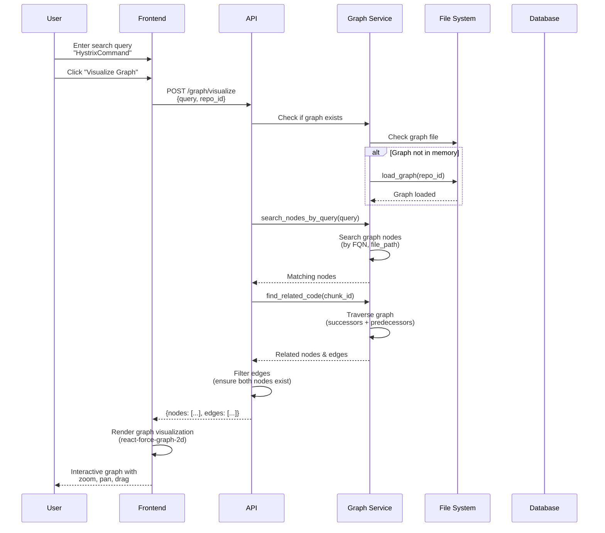

# Code Knowledge Platform - Complete Implementation Guide

## 📋 Table of Contents

1. [Overview](#overview)
2. [Architecture](#architecture)
3. [Implementation Details](#implementation-details)
4. [Sequence Diagrams](#sequence-diagrams)
5. [TigerGraph Integration](#tigergraph-integration)
6. [Database Migrations](#database-migrations)
7. [Deployment Guide](#deployment-guide)

---

## 🎯 Overview

The Code Knowledge Platform is an AI-powered system for understanding, indexing, and querying enterprise codebases. It provides:

- **Multi-Language Code Parsing**: TreeSitter-based parsing for Python, JavaScript/TypeScript, Java, Go, and Rust
- **Knowledge Graph Construction**: NetworkX-based in-memory graphs with optional TigerGraph persistence
- **Advanced RAG Pipeline**: Multi-hop reasoning with completeness verification
- **Hybrid Search**: Semantic vector search + lexical keyword matching
- **Intelligent Q&A**: LLM-powered answers with code citations
- **Graph Visualization**: Interactive exploration of code relationships

### Key Features

✅ **Multi-Repository Support**: Index and query across multiple repositories  
✅ **Cross-Repository Dependencies**: Track relationships between different repos  
✅ **Branch-Specific Queries**: Query specific branches of repositories  
✅ **Incremental Indexing**: Only re-index changed files  
✅ **Graph Persistence**: Save/load graphs across application restarts  
✅ **Async Job Processing**: Background graph building with progress tracking  
✅ **Real-time Updates**: WebSocket notifications for job progress  

---

## 🏗️ Architecture

### System Architecture Diagram



### Component Responsibilities

| Component | Responsibility |
|-----------|---------------|
| **Repository Manager** | Repository registration, cloning, file scanning, incremental indexing |
| **Multi-Language Parser** | TreeSitter-based AST parsing for multiple languages |
| **Code Indexer** | Chunk creation, metadata extraction, relationship discovery |
| **Graph Service** | Knowledge graph construction, traversal, persistence |
| **Search Service** | Hybrid search (semantic + lexical), reranking |
| **Advanced RAG** | Multi-hop retrieval, completeness verification |
| **LLM Service** | Answer generation with code citations |

---

## 📚 Implementation Details

### 1. Multi-Language Code Parsing

**File**: `backend/app/services/multi_language_parser.py`

Uses TreeSitter for language-agnostic parsing:

```python
class MultiLanguageParser:
    """Multi-language code parser using TreeSitter."""
    
    def parse_code_file(self, file_path: str, language: str) -> Dict[str, Any]:
        """
        Parse a code file and extract:
        - Functions/methods
        - Classes/interfaces
        - Imports/dependencies
        - Signatures and docstrings
        """
```

**Supported Languages**:
- Python (`tree-sitter-python`)
- JavaScript/TypeScript (`tree-sitter-javascript`)
- Java (`tree-sitter-java`)
- Go (`tree-sitter-go`)
- Rust (`tree-sitter-rust`)

### 2. Knowledge Graph Construction

**File**: `backend/app/services/graph_service.py`

**Graph Structure**:
- **Nodes**: Code chunks (methods, classes, files, modules)
- **Edges**: Relationships (calls, imports, extends, implements, belongs_to, in_file)

**Node Attributes**:
```python
{
    "chunk_id": 123,
    "fqn": "com.example.Service.method",
    "type": "method",
    "repository_id": 1,
    "file_path": "/path/to/file.java"
}
```

**Edge Attributes**:
```python
{
    "relationship": "calls",
    "source": "chunk_123",
    "target": "chunk_456"
}
```

**Graph Operations**:
- `build_graph_from_chunks()`: Construct graph from database chunks
- `find_related_code()`: Traverse graph to find related code
- `save_graph()`: Persist graph to pickle file
- `load_graph()`: Load graph from pickle file
- `get_graph_stats()`: Get node/edge counts

### 3. Advanced RAG Pipeline

**File**: `backend/app/services/advanced_rag_service.py`

**Features**:
- **Multi-Hop Retrieval**: Up to 5 hops of graph traversal
- **Reverse Traversal**: Find all callers/consumers
- **Completeness Verification**: LLM-based verification of answer completeness
- **Use Case Awareness**: Migration, impact analysis, product analysis

**Flow**:
1. Initial semantic search
2. Graph traversal from initial results
3. Entity extraction (functions, classes, REST endpoints)
4. Multi-hop expansion
5. Completeness verification

### 4. Graph Persistence

**Storage Location**: `backend/data/graphs/graph_repo_{repository_id}.pkl`

**Persistence Strategy**:
- Save graph after successful build
- Load all graphs on application startup
- Repository-specific graph files (one per repository)

---

## 📊 Sequence Diagrams

### 1. Repository Onboarding Flow



### 2. Knowledge Graph Building Flow



### 3. Code Query & Answer Flow



### 4. Graph Visualization Flow



---

## 🐅 TigerGraph Integration

### Overview

TigerGraph is an optional graph database for large-scale graph operations. The system uses a **hybrid approach**:
- **NetworkX**: Fast in-memory operations (default)
- **TigerGraph**: Optional persistence for large graphs (millions of nodes)

### Prerequisites

1. **TigerGraph Installation**
   ```bash
   # Option 1: TigerGraph Cloud (Recommended)
   # Sign up at https://www.tigergraph.com/cloud/
   
   # Option 2: Local Installation
   # Download from https://www.tigergraph.com/download/
   ```

2. **Python Package**
   ```bash
   pip install pyTigerGraph>=1.2.0
   ```

### Configuration

**File**: `backend/app/core/config.py`

Add TigerGraph settings:

```python
class Settings(BaseSettings):
    # ... existing settings ...
    
    # TigerGraph Configuration
    tigergraph_enabled: bool = False  # Enable TigerGraph
    tigergraph_host: Optional[str] = None  # e.g., "https://your-instance.i.tgcloud.io"
    tigergraph_graphname: Optional[str] = "code_knowledge_graph"
    tigergraph_username: Optional[str] = "tigergraph"
    tigergraph_password: Optional[str] = None
    tigergraph_secret: Optional[str] = None  # For cloud instances
    tigergraph_use_ssl: bool = True
```

**Environment Variables**:
```bash
TIGERGRAPH_ENABLED=true
TIGERGRAPH_HOST=https://your-instance.i.tgcloud.io
TIGERGRAPH_GRAPHNAME=code_knowledge_graph
TIGERGRAPH_USERNAME=tigergraph
TIGERGRAPH_PASSWORD=your_password
TIGERGRAPH_SECRET=your_secret  # For cloud
```

### Schema Definition

**Create Graph Schema in TigerGraph**:

```sql
-- Vertex Types
CREATE VERTEX CodeChunk (
    chunk_id INT PRIMARY KEY,
    fqn STRING,
    type STRING,
    repository_id INT,
    file_path STRING,
    code TEXT,
    summary STRING
)

-- Edge Types
CREATE DIRECTED EDGE CALLS (
    FROM CodeChunk,
    TO CodeChunk,
    relationship STRING
)

CREATE DIRECTED EDGE IMPORTS (
    FROM CodeChunk,
    TO CodeChunk,
    relationship STRING
)

CREATE DIRECTED EDGE EXTENDS (
    FROM CodeChunk,
    TO CodeChunk,
    relationship STRING
)

CREATE DIRECTED EDGE IMPLEMENTS (
    FROM CodeChunk,
    TO CodeChunk,
    relationship STRING
)

CREATE DIRECTED EDGE BELONGS_TO (
    FROM CodeChunk,
    TO CodeChunk,
    relationship STRING
)

CREATE DIRECTED EDGE IN_FILE (
    FROM CodeChunk,
    TO CodeChunk,
    relationship STRING
)

-- Graph
CREATE GRAPH code_knowledge_graph (
    CodeChunk,
    CALLS,
    IMPORTS,
    EXTENDS,
    IMPLEMENTS,
    BELONGS_TO,
    IN_FILE
)
```

### Implementation

**File**: `backend/app/services/graph_service.py`

Update `GraphService` to support TigerGraph:

```python
class GraphService:
    def __init__(self, graph_storage_path: Optional[str] = None):
        # ... existing NetworkX initialization ...
        
        # Initialize TigerGraph connection if enabled
        if TIGERGRAPH_AVAILABLE and settings.tigergraph_enabled:
            try:
                self.tigergraph_conn = TigerGraphConnection(
                    host=settings.tigergraph_host,
                    graphname=settings.tigergraph_graphname,
                    username=settings.tigergraph_username,
                    password=settings.tigergraph_password,
                    secret=settings.tigergraph_secret,
                    useCert=settings.tigergraph_use_ssl
                )
                logger.info("✅ TigerGraph connection established")
            except Exception as e:
                logger.error(f"Failed to connect to TigerGraph: {e}")
                self.tigergraph_conn = None
    
    def build_graph_from_chunks(self, session: Session, repository_id: Optional[int] = None, rebuild: bool = False) -> bool:
        """Build graph in both NetworkX and TigerGraph."""
        # ... build NetworkX graph (existing code) ...
        
        # Sync to TigerGraph if enabled
        if self.tigergraph_conn:
            self._sync_to_tigergraph(session, repository_id)
        
        return True
    
    def _sync_to_tigergraph(self, session: Session, repository_id: Optional[int] = None):
        """Sync NetworkX graph to TigerGraph."""
        if self.graph is None:
            return
        
        logger.info("🔄 Syncing graph to TigerGraph...")
        
        # Upsert vertices
        vertices = []
        for node_id, data in self.graph.nodes(data=True):
            if repository_id and data.get('repository_id') != repository_id:
                continue
            
            vertices.append({
                "chunk_id": data.get('chunk_id'),
                "fqn": data.get('fqn', ''),
                "type": data.get('type', ''),
                "repository_id": data.get('repository_id', 0),
                "file_path": data.get('file_path', ''),
                "code": data.get('code', '')[:1000],  # Truncate for TigerGraph
                "summary": data.get('summary', '')
            })
        
        # Batch upsert vertices
        self.tigergraph_conn.upsertVertex("CodeChunk", vertices)
        
        # Upsert edges
        edges = []
        for u, v, data in self.graph.edges(data=True):
            u_data = self.graph.nodes[u]
            v_data = self.graph.nodes[v]
            
            if repository_id:
                if u_data.get('repository_id') != repository_id and v_data.get('repository_id') != repository_id:
                    continue
            
            relationship = data.get('relationship', 'related')
            edge_type = self._map_relationship_to_edge_type(relationship)
            
            edges.append({
                "from": {"chunk_id": u_data.get('chunk_id')},
                "to": {"chunk_id": v_data.get('chunk_id')},
                "relationship": relationship
            })
        
        # Batch upsert edges
        for edge_type, edge_list in self._group_edges_by_type(edges):
            self.tigergraph_conn.upsertEdge("CodeChunk", edge_list, edge_type)
        
        logger.info(f"✅ Synced {len(vertices)} vertices and {len(edges)} edges to TigerGraph")
    
    def _map_relationship_to_edge_type(self, relationship: str) -> str:
        """Map relationship type to TigerGraph edge type."""
        mapping = {
            'calls': 'CALLS',
            'imports': 'IMPORTS',
            'extends': 'EXTENDS',
            'implements': 'IMPLEMENTS',
            'belongs_to': 'BELONGS_TO',
            'in_file': 'IN_FILE'
        }
        return mapping.get(relationship, 'CALLS')
    
    async def find_related_code_tigergraph(
        self,
        chunk_id: int,
        max_depth: int = 2,
        relationship_types: Optional[List[str]] = None
    ) -> List[Dict[str, Any]]:
        """Find related code using TigerGraph queries."""
        if not self.tigergraph_conn:
            return []
        
        # Use GSQL query for graph traversal
        query = f"""
        INTERPRET QUERY () FOR GRAPH {self.tigergraph_conn.graphname} {{
            SetAccum<VERTEX<CodeChunk>> @@visited;
            SetAccum<EDGE> @@edges;
            ListAccum<VERTEX<CodeChunk>> @@results;
            
            Start = {{CodeChunk.*}};
            Start = SELECT s FROM Start:s WHERE s.chunk_id == {chunk_id};
            
            Result = SELECT t FROM Start:s -(CALLS|IMPORTS|EXTENDS|IMPLEMENTS:e)-> CodeChunk:t
                ACCUM @@visited += t, @@edges += e, @@results += t;
            
            PRINT @@results, @@edges;
        }}
        """
        
        result = self.tigergraph_conn.runInterpretedQuery(query)
        # Process and return results
        return self._process_tigergraph_results(result)
```

### GSQL Queries for Common Operations

**1. Find All Callers of a Method**:
```sql
INTERPRET QUERY (INT chunk_id) FOR GRAPH code_knowledge_graph {
    SetAccum<VERTEX<CodeChunk>> @@callers;
    
    Start = {CodeChunk.*};
    Start = SELECT s FROM Start:s WHERE s.chunk_id == chunk_id;
    
    Callers = SELECT t FROM Start:s <-(CALLS:e)- CodeChunk:t
        ACCUM @@callers += t;
    
    PRINT @@callers;
}
```

**2. Find Impact of Changing a Class**:
```sql
INTERPRET QUERY (INT chunk_id, INT max_depth) FOR GRAPH code_knowledge_graph {
    SetAccum<VERTEX<CodeChunk>> @@impact;
    SetAccum<EDGE> @@paths;
    
    Start = {CodeChunk.*};
    Start = SELECT s FROM Start:s WHERE s.chunk_id == chunk_id;
    
    Impact = SELECT t FROM Start:s -(CALLS|EXTENDS|IMPLEMENTS:e)-> CodeChunk:t
        WHERE t.type == "class" OR t.type == "method"
        ACCUM @@impact += t, @@paths += e;
    
    PRINT @@impact, @@paths;
}
```

**3. Find Cross-Repository Dependencies**:
```sql
INTERPRET QUERY (INT repo_id) FOR GRAPH code_knowledge_graph {
    SetAccum<VERTEX<CodeChunk>> @@external;
    SetAccum<EDGE> @@cross_repo_edges;
    
    RepoChunks = {CodeChunk.*};
    RepoChunks = SELECT s FROM RepoChunks:s WHERE s.repository_id == repo_id;
    
    External = SELECT t FROM RepoChunks:s -(IMPORTS|CALLS:e)-> CodeChunk:t
        WHERE t.repository_id != repo_id
        ACCUM @@external += t, @@cross_repo_edges += e;
    
    PRINT @@external, @@cross_repo_edges;
}
```

### Migration Steps

1. **Install TigerGraph** (Cloud or Local)
2. **Create Graph Schema** (using GSQL above)
3. **Update Configuration** (add TigerGraph settings to `config.py`)
4. **Set Environment Variables**
5. **Update Graph Service** (add TigerGraph sync methods)
6. **Test Connection**:
   ```python
   from app.services.graph_service import graph_service
   if graph_service.tigergraph_conn:
       print("✅ TigerGraph connected")
   ```

### Benefits of TigerGraph

- **Scalability**: Handle millions of nodes and edges
- **Performance**: Optimized graph queries with GSQL
- **Persistence**: Permanent storage (vs. in-memory NetworkX)
- **Advanced Queries**: Complex graph algorithms (PageRank, shortest path, etc.)
- **Real-time Updates**: Concurrent graph modifications

---

## 🗄️ Database Migrations

### Current Schema

**Tables**:
1. `java_repositories` - Repository metadata
2. `java_chunks` - Code chunks (methods, classes, files)
3. `conversations` - Chat conversations
4. `messages` - Chat messages
5. `jobs` - Async job tracking

### Migration Scripts

All migration scripts are in `backend/scripts/`:

#### 1. Add Thinking Mode Column

**File**: `backend/scripts/add_thinking_mode_column.py`

```python
def add_thinking_mode_column():
    """Add thinking_mode column to conversations table."""
    import sqlite3
    from app.core.config import settings
    
    db_path = settings.database_url.replace("sqlite:///", "")
    conn = sqlite3.connect(db_path)
    cursor = conn.cursor()
    
    try:
        cursor.execute("PRAGMA table_info(conversations)")
        columns = [col[1] for col in cursor.fetchall()]
        
        if 'thinking_mode' not in columns:
            cursor.execute("ALTER TABLE conversations ADD COLUMN thinking_mode VARCHAR DEFAULT 'thinking'")
            conn.commit()
            print("✅ Added thinking_mode column")
    except Exception as e:
        print(f"❌ Error: {e}")
        conn.rollback()
    finally:
        conn.close()
```

**Run**:
```bash
cd backend
python scripts/add_thinking_mode_column.py
```

#### 2. Add Repository Columns

**File**: `backend/scripts/add_repository_columns.py`

Adds: `github_url`, `github_branch`, `file_count`, `languages`

**Run**:
```bash
python scripts/add_repository_columns.py
```

#### 3. Add Branch Column to Chunks

**File**: `backend/scripts/add_branch_to_chunks.py` (NEW - to be created)

```python
def add_branch_to_chunks():
    """Add branch column to java_chunks table."""
    import sqlite3
    from app.core.config import settings
    
    db_path = settings.database_url.replace("sqlite:///", "")
    conn = sqlite3.connect(db_path)
    cursor = conn.cursor()
    
    try:
        cursor.execute("PRAGMA table_info(java_chunks)")
        columns = [col[1] for col in cursor.fetchall()]
        
        if 'branch' not in columns:
            cursor.execute("ALTER TABLE java_chunks ADD COLUMN branch VARCHAR")
            # Backfill from repository
            cursor.execute("""
                UPDATE java_chunks 
                SET branch = (
                    SELECT github_branch FROM java_repositories 
                    WHERE java_repositories.id = java_chunks.repository_id
                )
            """)
            conn.commit()
            print("✅ Added branch column to java_chunks")
        else:
            print("ℹ️ branch column already exists")
    except Exception as e:
        print(f"❌ Error: {e}")
        conn.rollback()
    finally:
        conn.close()

if __name__ == "__main__":
    add_branch_to_chunks()
```

### Creating New Migrations

**Template**:

```python
"""Migration script: Add {description}."""
import sqlite3
from app.core.config import settings

def migrate():
    """Run migration."""
    db_path = settings.database_url.replace("sqlite:///", "")
    conn = sqlite3.connect(db_path)
    cursor = conn.cursor()
    
    try:
        # Check if migration already applied
        cursor.execute("PRAGMA table_info({table_name})")
        columns = [col[1] for col in cursor.fetchall()]
        
        if '{column_name}' not in columns:
            # Apply migration
            cursor.execute("ALTER TABLE {table_name} ADD COLUMN {column_name} {type}")
            
            # Backfill data if needed
            # cursor.execute("UPDATE {table_name} SET {column_name} = {default_value}")
            
            conn.commit()
            print("✅ Migration applied successfully")
        else:
            print("ℹ️ Migration already applied")
    except Exception as e:
        print(f"❌ Migration failed: {e}")
        conn.rollback()
    finally:
        conn.close()

if __name__ == "__main__":
    migrate()
```

### Migration Best Practices

1. **Always Check First**: Verify column/table doesn't exist
2. **Backfill Data**: Set default values for existing rows
3. **Transaction Safety**: Use try/except with rollback
4. **Idempotent**: Scripts should be safe to run multiple times
5. **Documentation**: Comment what the migration does

### Database Schema Evolution

**Current Schema**:

```sql
-- java_repositories
CREATE TABLE java_repositories (
    id INTEGER PRIMARY KEY,
    name VARCHAR NOT NULL,
    local_path VARCHAR,
    github_url VARCHAR,
    github_branch VARCHAR DEFAULT 'main',
    description VARCHAR,
    status VARCHAR DEFAULT 'pending',
    file_count INTEGER,
    languages VARCHAR,  -- JSON array
    last_indexed_at TIMESTAMP,
    created_at TIMESTAMP,
    updated_at TIMESTAMP
);

-- java_chunks
CREATE TABLE java_chunks (
    id INTEGER PRIMARY KEY,
    type VARCHAR NOT NULL,  -- method, class, file, module
    fqn VARCHAR NOT NULL,  -- Fully qualified name
    file_path VARCHAR NOT NULL,
    start_line INTEGER,
    end_line INTEGER,
    code TEXT,
    summary VARCHAR,
    imports TEXT,  -- JSON array
    annotations TEXT,  -- JSON array
    callers TEXT,  -- JSON array
    callees TEXT,  -- JSON array
    implemented_interfaces TEXT,  -- JSON array
    extended_class VARCHAR,
    test_references TEXT,  -- JSON array
    repository_id INTEGER NOT NULL,
    branch VARCHAR,  -- NEW: Branch name
    last_modified TIMESTAMP,
    created_at TIMESTAMP,
    updated_at TIMESTAMP,
    FOREIGN KEY (repository_id) REFERENCES java_repositories(id)
);

-- conversations
CREATE TABLE conversations (
    id INTEGER PRIMARY KEY,
    title VARCHAR,
    thinking_mode VARCHAR DEFAULT 'thinking',  -- NEW
    created_at TIMESTAMP,
    updated_at TIMESTAMP
);

-- jobs
CREATE TABLE jobs (
    id INTEGER PRIMARY KEY,
    job_id VARCHAR UNIQUE NOT NULL,
    job_type VARCHAR NOT NULL,
    status VARCHAR NOT NULL,
    progress INTEGER DEFAULT 0,
    params TEXT,  -- JSON
    progress_data TEXT,  -- JSON (nodes, edges, message)
    error VARCHAR,
    created_at TIMESTAMP,
    updated_at TIMESTAMP
);
```

---

## 🚀 Deployment Guide

### 1. Prerequisites

```bash
# Python 3.11+
python --version

# Node.js 18+
node --version

# Git (for GitHub integration)
git --version
```

### 2. Backend Setup

```bash
cd backend

# Install dependencies
pip install -r requirements.txt

# Install optional dependencies
pip install pyTigerGraph>=1.2.0  # If using TigerGraph

# Run migrations
python scripts/add_thinking_mode_column.py
python scripts/add_repository_columns.py
python scripts/add_branch_to_chunks.py  # If needed

# Set environment variables
export OPENAI_API_KEY=your_key
export TIGERGRAPH_ENABLED=false  # or true
export TIGERGRAPH_HOST=your_host  # if enabled

# Start server
uvicorn main:app --reload --host 0.0.0.0 --port 8000
```

### 3. Frontend Setup

```bash
cd frontend

# Install dependencies
npm install

# Install graph visualization library
npm install react-force-graph-2d d3-force

# Start dev server
npm run dev
```

### 4. Production Deployment

**Backend**:
```bash
# Use production WSGI server
gunicorn main:app -w 4 -k uvicorn.workers.UvicornWorker --bind 0.0.0.0:8000
```

**Frontend**:
```bash
npm run build
# Serve dist/ directory with nginx or similar
```

### 5. Environment Configuration

**`.env` file**:
```bash
# Database
DATABASE_URL=sqlite:///./data/chat.db

# OpenAI
OPENAI_API_KEY=sk-...
OPENAI_MODEL=gpt-4

# TigerGraph (optional)
TIGERGRAPH_ENABLED=false
TIGERGRAPH_HOST=https://your-instance.i.tgcloud.io
TIGERGRAPH_GRAPHNAME=code_knowledge_graph
TIGERGRAPH_USERNAME=tigergraph
TIGERGRAPH_PASSWORD=your_password

# OpenSearch (optional)
OPENSEARCH_HOST=search-domain.us-east-1.es.amazonaws.com
OPENSEARCH_INDEX=java_code_chunks
OPENSEARCH_REGION=us-east-1

# GitHub (for private repos)
GITHUB_TOKEN=ghp_...
GITHUB_USERNAME=your_username
```

---

## 📝 Summary

### Key Implementation Points

1. **Multi-Language Support**: TreeSitter parsers for 5+ languages
2. **Hybrid Graph Storage**: NetworkX (default) + TigerGraph (optional)
3. **Graph Persistence**: Pickle files for repository-specific graphs
4. **Async Processing**: Background jobs with progress tracking
5. **Advanced RAG**: Multi-hop reasoning with completeness verification
6. **Branch Support**: Store and query by branch (via migration)

### Next Steps

1. ✅ Implement branch column migration
2. ✅ Add branch filtering to search queries
3. ✅ Update API endpoints to accept branch parameter
4. ✅ Enable TigerGraph integration (if needed)
5. ✅ Add branch selector in frontend UI

---

## 📚 Additional Resources

- [TreeSitter Documentation](https://tree-sitter.github.io/tree-sitter/)
- [NetworkX Documentation](https://networkx.org/)
- [TigerGraph Documentation](https://docs.tigergraph.com/)
- [LangGraph Documentation](https://langchain-ai.github.io/langgraph/)
- [React Force Graph](https://github.com/vasturiano/react-force-graph)

---

**Document Version**: 1.0  
**Last Updated**: 2024-12-13  
**Maintained By**: Development Team

