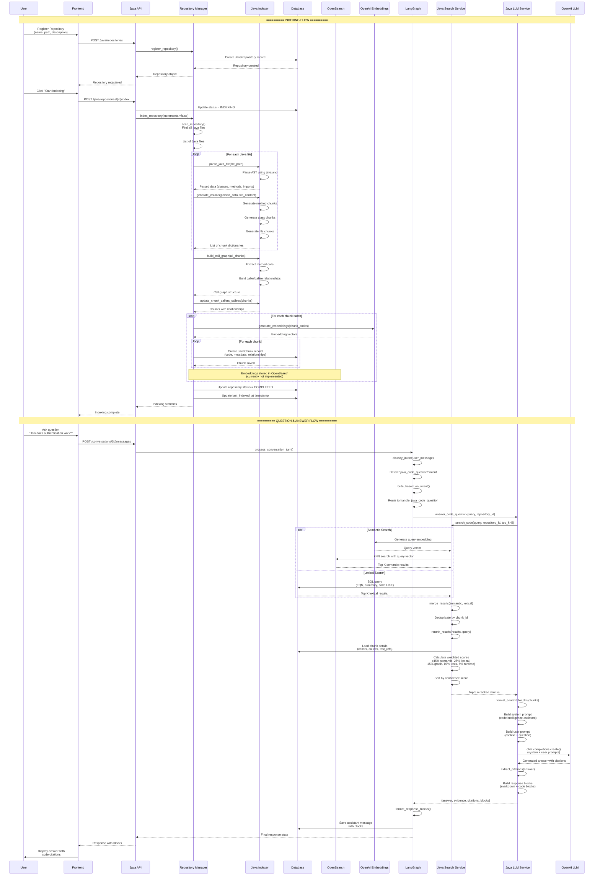

# Java Code Intelligence - System Flow Diagram

## Complete Flow: From Indexing to Question & Answer



## Key Components

### Indexing Flow
1. **Repository Registration**: User registers a Java repository with name and path
2. **File Scanning**: Repository Manager scans for all `.java` files
3. **AST Parsing**: Java Indexer parses each file to extract classes, methods, imports
4. **Chunk Generation**: Creates chunks at method, class, and file levels
5. **Call Graph Building**: Analyzes method calls to build caller/callee relationships
6. **Embedding Generation**: Generates vector embeddings for semantic search
7. **Storage**: Saves chunks to database with metadata and relationships

### Question & Answer Flow
1. **Intent Classification**: LangGraph detects Java code question intent
2. **Hybrid Search**: 
   - **Semantic**: Vector similarity search in OpenSearch
   - **Lexical**: Keyword matching in database
3. **Result Merging**: Combines and deduplicates results
4. **Reranking**: Scores results using weighted formula:
   - 45% semantic similarity
   - 25% lexical match
   - 15% graph proximity (callers/callees)
   - 10% test references
   - 5% runtime hits
5. **Context Formatting**: Formats top chunks for LLM context
6. **Answer Generation**: LLM generates answer with file:line citations
7. **Response Building**: Creates markdown and code blocks for frontend

## Data Flow

```
Repository Files
    ↓
AST Parsing (javalang)
    ↓
Code Chunks (method/class/file)
    ↓
Call Graph (callers/callees)
    ↓
Embeddings (OpenAI)
    ↓
Database (SQLite) + OpenSearch (vectors)
    ↓
Hybrid Search (semantic + lexical)
    ↓
Reranking (weighted scoring)
    ↓
LLM Context
    ↓
Answer Generation
    ↓
Response with Citations
```

## Storage Locations

- **Database (SQLite)**: 
  - Repository metadata
  - Code chunks (code, FQN, file_path, line numbers)
  - Relationships (callers, callees, imports, annotations)
  - Status and timestamps

- **OpenSearch** (planned):
  - Vector embeddings for semantic search
  - Chunk metadata for kNN queries

## Search Strategy

1. **Semantic Search**: Uses vector embeddings to find semantically similar code
2. **Lexical Search**: Uses SQL LIKE queries for exact keyword matches
3. **Graph Proximity**: Considers call graph relationships
4. **Test References**: Boosts chunks referenced by tests
5. **Reranking**: Combines all signals for final relevance score

