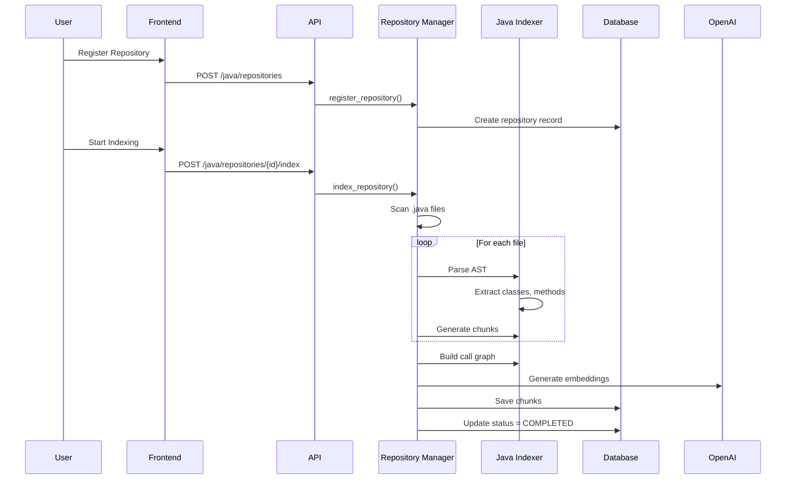
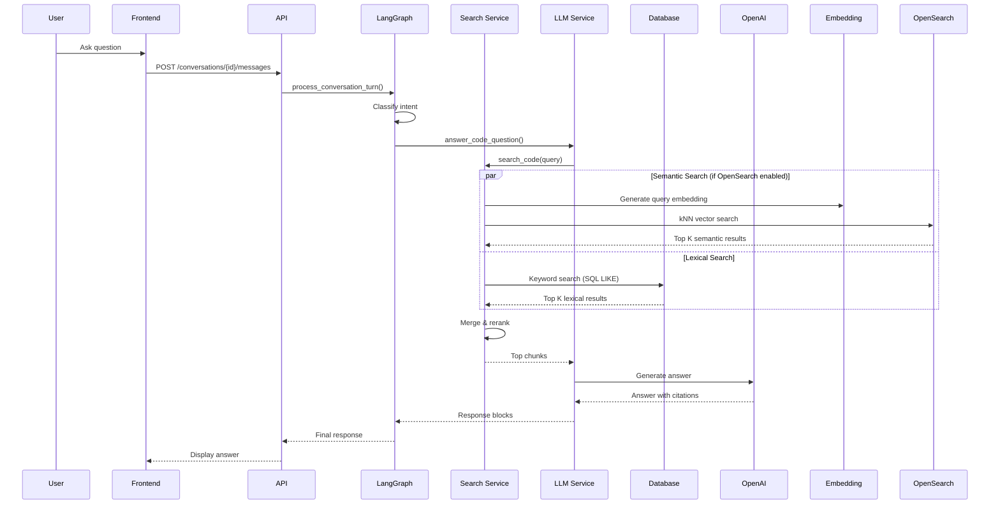

# Java Code Intelligence & Assistant Platform

A comprehensive AI-powered code understanding, indexing, and Q&A system for large Java codebases. This platform enables developers to ask natural language questions about their codebase and receive precise, evidence-backed answers with file and line number citations.

## 📋 Table of Contents

- [Overview](#overview)
- [Features](#features)
- [Architecture](#architecture)
- [Installation](#installation)
- [Configuration](#configuration)
- [Usage](#usage)
- [API Documentation](#api-documentation)
- [Sequence Diagrams](#sequence-diagrams)
- [Development](#development)
- [Troubleshooting](#troubleshooting)

## 🎯 Overview

The Java Code Intelligence platform provides:

- **AST-based Code Parsing**: Extracts classes, methods, imports, and annotations from Java source files
- **Multi-level Chunking**: Creates code chunks at method, class, file, and module levels
- **Call Graph Analysis**: Builds relationships between methods (callers/callees)
- **Hybrid Search**: Combines semantic vector search with lexical keyword matching
- **Intelligent Reranking**: Uses multiple signals (semantic, lexical, graph proximity, test references)
- **LLM-powered Q&A**: Generates natural language answers with code citations
- **Incremental Indexing**: Only re-indexes changed files for efficiency

## ✨ Features

### Code Intelligence
- ✅ Parse and understand large Java repositories
- ✅ Extract AST, symbol tables, method/class metadata
- ✅ Build call graphs and type hierarchies
- ✅ Summarize methods, classes, files, and modules
- ✅ Answer detailed multi-hop questions

### Search & Retrieval
- ✅ Vector embeddings for semantic understanding
- ✅ Lexical search for exact matches
- ✅ Multi-hop retrieval using call graphs
- ✅ Custom reranking with weighted scoring
- ✅ Graph proximity analysis

### Question & Answer
- ✅ Natural language code questions
- ✅ Evidence-backed answers with file:line citations
- ✅ Code block rendering with syntax highlighting
- ✅ Context-aware responses using conversation history

## 🏗️ Architecture

### System Components

```
┌─────────────────────────────────────────────────────────────┐
│                    Frontend (React)                         │
│  - Java Repository Onboarding UI                           │
│  - Repository List & Management                            │
│  - Chat Interface for Q&A                                  │
└──────────────────────┬──────────────────────────────────────┘
                       │
┌──────────────────────▼──────────────────────────────────────┐
│              Backend API (FastAPI)                         │
│  - /java/repositories (CRUD)                               │
│  - /java/repositories/{id}/index                            │
│  - /java/search                                            │
│  - /java/ask                                               │
└──────────────────────┬──────────────────────────────────────┘
                       │
        ┌──────────────┼──────────────┐
        │              │              │
┌───────▼──────┐ ┌────▼──────┐ ┌────▼──────────┐
│  Repository   │ │   Java    │ │   Java        │
│   Manager     │ │  Indexer  │ │  Search      │
└───────┬───────┘ └────┬──────┘ └────┬──────────┘
        │              │              │
        └──────────────┼──────────────┘
                       │
        ┌──────────────┼──────────────┐
        │              │              │
┌───────▼──────┐ ┌────▼──────┐ ┌────▼──────────┐
│  Database    │ │ OpenSearch│ │   OpenAI      │
│  (SQLite)    │ │ (Vectors) │ │  (LLM/Embed)  │
└──────────────┘ └───────────┘ └───────────────┘
```

## 📊 Data Structures

### AST (Abstract Syntax Tree) Structure

The parsed AST structure extracted from Java source files:

```python
{
    "package": "com.example.service",           # Package name
    "imports": [                                # List of import statements
        "java.util.List",
        "java.util.Map",
        "org.springframework.stereotype.Service"
    ],
    "file_path": "src/main/java/com/example/UserService.java",
    "classes": [                                # List of class declarations
        {
            "name": "UserService",             # Class name
            "fqn": "com.example.service.UserService",  # Fully qualified name
            "annotations": ["Service", "Component"],   # Class annotations
            "extended_class": "BaseService",    # Parent class (if any)
            "implemented_interfaces": [        # Implemented interfaces
                "UserRepository",
                "Serializable"
            ],
            "file_path": "src/main/java/com/example/UserService.java"
        }
    ],
    "methods": [                                # List of method declarations
        {
            "name": "authenticate",            # Method name
            "fqn": "com.example.service.UserService.authenticate",  # FQN
            "return_type": "User",             # Return type
            "parameters": [                     # Method parameters
                "String username",
                "String password"
            ],
            "annotations": ["Override", "Transactional"],  # Method annotations
            "class_fqn": "com.example.service.UserService",
            "file_path": "src/main/java/com/example/UserService.java",
            "start_line": 45                   # Line number where method starts
        }
    ]
}
```

### Chunk Structure

Code chunks are stored at multiple levels (method, class, file, module):

```python
{
    # Basic Information
    "id": 123,                                  # Database ID
    "type": "method",                           # Chunk type: "method" | "class" | "file" | "module"
    "fqn": "com.example.service.UserService.authenticate",  # Fully qualified name
    "file_path": "src/main/java/com/example/UserService.java",
    "start_line": 45,                           # Starting line number
    "end_line": 78,                             # Ending line number
    "code": "public User authenticate(String username, String password) {\n  ...\n}",  # Source code
    "summary": "Authenticates user with username and password",  # Generated summary
    
    # Relationships (stored as JSON arrays)
    "imports": [                                # Import statements used
        "java.util.List",
        "org.springframework.stereotype.Service"
    ],
    "annotations": [                            # Annotations on this chunk
        "Override",
        "Transactional"
    ],
    "callers": [                                # Methods that call this method
        "com.example.controller.AuthController.login",
        "com.example.service.SessionService.createSession"
    ],
    "callees": [                                # Methods called by this method
        "com.example.repository.UserRepository.findByUsername",
        "com.example.util.PasswordUtil.verify"
    ],
    "implemented_interfaces": [                # Interfaces implemented (for classes)
        "UserRepository",
        "Serializable"
    ],
    "extended_class": "BaseService",            # Parent class (for classes)
    "test_references": [                        # Test methods that reference this
        "com.example.test.UserServiceTest.testAuthenticate",
        "com.example.test.IntegrationTest.testLoginFlow"
    ],
    
    # Metadata
    "repository_id": 1,                        # Parent repository ID
    "last_modified": "2024-01-15T10:30:00Z",  # Last modification timestamp
    "created_at": "2024-01-15T10:00:00Z",      # Creation timestamp
    "updated_at": "2024-01-15T10:30:00Z"       # Last update timestamp
}
```

#### Chunk Types

1. **Method Chunk** (`type: "method"`)
   - Individual method with full implementation
   - Includes method signature, body, and annotations
   - Example: `UserService.authenticate()`

2. **Class Chunk** (`type: "class"`)
   - Entire class definition
   - Includes all methods, fields, and class-level metadata
   - Example: `UserService` class

3. **File Chunk** (`type: "file"`)
   - Complete source file
   - Includes all classes and top-level code
   - Example: `UserService.java` file

4. **Module Chunk** (`type: "module"`)
   - Package or module-level overview
   - Aggregates multiple files in a package
   - Example: `com.example.service` package

### Repository Structure

```python
{
    "id": 1,                                    # Repository ID
    "name": "my-java-project",                  # Repository name
    "local_path": "/path/to/java/project",     # Local file system path
    "description": "Main application codebase", # Optional description
    "status": "completed",                      # Status: "pending" | "indexing" | "completed" | "failed"
    "last_indexed_at": "2024-01-15T10:30:00Z", # Last indexing timestamp
    "created_at": "2024-01-15T09:00:00Z",      # Creation timestamp
    "updated_at": "2024-01-15T10:30:00Z"       # Last update timestamp
}
```

### Call Graph Structure

The call graph represents method relationships:

```python
{
    # Call Graph: method_fqn -> set of callee_fqns
    "com.example.service.UserService.authenticate": {
        "com.example.repository.UserRepository.findByUsername",
        "com.example.util.PasswordUtil.verify",
        "com.example.service.SessionService.createSession"
    },
    "com.example.controller.AuthController.login": {
        "com.example.service.UserService.authenticate",
        "com.example.service.SessionService.createSession"
    },
    
    # Reverse Call Graph: method_fqn -> set of caller_fqns
    # Built automatically from call graph
    "com.example.service.UserService.authenticate": {
        "com.example.controller.AuthController.login",
        "com.example.service.SessionService.refresh"
    }
}
```

### Search Result Structure

Results from code search operations:

```python
{
    "chunk_id": 123,                            # Chunk database ID
    "repository_id": 1,                        # Repository ID
    "type": "method",                          # Chunk type
    "fqn": "com.example.service.UserService.authenticate",
    "file_path": "src/main/java/com/example/UserService.java",
    "start_line": 45,
    "end_line": 78,
    "code": "...",                             # Source code
    "summary": "Authenticates user...",        # Chunk summary
    
    # Scoring Information
    "semantic_score": 0.95,                    # Semantic similarity score (0-1)
    "lexical_score": 0.85,                     # Lexical match score (0-1)
    "graph_proximity": 0.70,                   # Graph relationship score (0-1)
    "test_references": 0.60,                   # Test reference score (0-1)
    "runtime_hits": 0.0,                       # Runtime trace hits (0-1)
    "confidence": 0.88,                        # Final weighted confidence score
    "final_score": 0.88                        # Same as confidence
}
```

### Question & Answer Response Structure

Response from `/java/ask` endpoint:

```python
{
    "answer": "Authentication is handled by the UserService.authenticate() method...",
    "evidence": [                              # Top evidence chunks
        {
            "chunk_id": 123,
            "fqn": "com.example.service.UserService.authenticate",
            "file_path": "src/main/java/com/example/UserService.java",
            "start_line": 45,
            "end_line": 78,
            "code": "public User authenticate(String username, String password) {...}",
            "summary": "Authenticates user with username and password",
            "confidence": 0.88
        }
    ],
    "citations": [                             # File:line citations
        {
            "file_path": "src/main/java/com/example/UserService.java",
            "start_line": 45,
            "end_line": 78,
            "fqn": "com.example.service.UserService.authenticate"
        }
    ],
    "blocks": [                                # Frontend rendering blocks
        {
            "type": "markdown",
            "data": {
                "content": "Authentication is handled by..."
            }
        },
        {
            "type": "code",
            "data": {
                "code": "public User authenticate(...) {...}",
                "language": "java",
                "title": "UserService.authenticate (UserService.java:45-78)"
            }
        }
    ]
}
```

### Data Flow Summary

```
Java Source File
    ↓
AST Parsing (javalang)
    ↓
Parsed Data Structure (package, imports, classes, methods)
    ↓
Chunk Generation (method/class/file/module)
    ↓
Call Graph Building (callers/callees)
    ↓
Embedding Generation (OpenAI)
    ↓
Storage:
  - Database: Chunks with metadata
  - OpenSearch: Vector embeddings (planned)
    ↓
Search & Retrieval
    ↓
Reranking (weighted scoring)
    ↓
LLM Context Formatting
    ↓
Answer Generation with Citations
```

### Processing Pipeline

1. **Repository Registration** → Database
2. **File Scanning** → Discover Java files
3. **AST Parsing** → Extract code structure
4. **Chunk Generation** → Create code chunks
5. **Call Graph Building** → Analyze relationships
6. **Embedding Generation** → Create vector embeddings
7. **Storage** → Database + OpenSearch

## 📦 Installation

### Prerequisites

- Python 3.9+
- Node.js 18+
- SQLite (or PostgreSQL/CockroachDB)
- OpenAI API key (for embeddings and LLM)
- OpenSearch (optional, for vector search)

### Backend Setup

```bash
cd backend

# Create virtual environment
python3 -m venv venv
source venv/bin/activate  # On Windows: venv\Scripts\activate

# Install dependencies
pip install -r requirements.txt

# Required packages for Java code intelligence:
# - javalang>=0.13.0 (AST parsing)
# - networkx>=3.0 (call graph)
# - openai (embeddings and LLM)
# - opensearch-py (vector search)
```

### Frontend Setup

```bash
cd frontend

# Install dependencies
npm install

# Start development server
npm run dev
```

### Environment Variables

Create a `.env` file in the backend directory:

```env
# OpenAI Configuration
OPENAI_API_KEY=your_openai_api_key_here
OPENAI_MODEL=gpt-4
JAVA_EMBEDDING_MODEL=text-embedding-3-small

# Java Code Intelligence
JAVA_INDEXER_ENABLED=true
JAVA_REPOSITORIES_PATH=./java_repositories
JAVA_INDEXER_BATCH_SIZE=100
JAVA_MAX_CHUNK_SIZE=1000
JAVA_OPENSEARCH_INDEX=java_code_chunks
JAVA_OPENSEARCH_ENABLED=true  # Enable OpenSearch integration for semantic search

# OpenSearch Configuration (Required if JAVA_OPENSEARCH_ENABLED=true)
OPENSEARCH_HOST=localhost:9200
OPENSEARCH_INDEX=java_code_chunks
OPENSEARCH_REGION=us-east-1
OPENSEARCH_USE_AWS_AUTH=false  # Set to true for AWS OpenSearch
OPENSEARCH_USERNAME=admin  # For basic auth (local dev)
OPENSEARCH_PASSWORD=admin  # For basic auth (local dev)
OPENSEARCH_USE_SSL=true
OPENSEARCH_VERIFY_CERTS=true
OPENSEARCH_USE_VECTOR_SEARCH=true
```

## ⚙️ Configuration

### Backend Configuration

Edit `backend/app/core/config.py`:

```python
# Java Code Intelligence Configuration
java_indexer_enabled: bool = True
java_repositories_path: str = "./java_repositories"
java_indexer_batch_size: int = 100
java_embedding_model: str = "text-embedding-3-small"
java_max_chunk_size: int = 1000
java_opensearch_index: str = "java_code_chunks"
java_opensearch_enabled: bool = True  # Enable/disable OpenSearch integration
```

### OpenSearch Integration

The OpenSearch integration can be enabled/disabled via the `JAVA_OPENSEARCH_ENABLED` flag:

- **Enabled** (`true`): 
  - Chunks are indexed in OpenSearch with vector embeddings
  - Semantic search uses kNN vector similarity
  - Hybrid search combines semantic + lexical results
  - Requires OpenSearch to be configured and running

- **Disabled** (`false`):
  - Only database storage (SQLite/PostgreSQL)
  - Only lexical search (keyword matching)
  - No vector embeddings stored
  - Works without OpenSearch dependency

**Note**: When disabled, the system gracefully falls back to lexical-only search. All other features continue to work normally.

### Indexing Options

- **Incremental Indexing**: Only processes changed files (default: `true`)
- **Full Indexing**: Re-processes all files (set `incremental: false`)
- **Batch Size**: Number of chunks processed per batch (default: 100)

## 🚀 Usage

### 1. Register a Repository

**Via UI:**
1. Navigate to Marketplace → Java Code Intelligence
2. Enter repository name and local path
3. Click "Register Repository"

**Via API:**
```bash
curl -X POST http://localhost:8000/java/repositories \
  -H "Content-Type: application/json" \
  -H "Authorization: Bearer YOUR_TOKEN" \
  -d '{
    "name": "my-java-project",
    "local_path": "/path/to/java/project",
    "description": "Main application codebase"
  }'
```

### 2. Start Indexing

**Via UI:**
1. Go to Java Repositories page
2. Click "Start Indexing" on your repository
3. Monitor progress (status updates automatically)

**Via API:**
```bash
curl -X POST http://localhost:8000/java/repositories/1/index \
  -H "Content-Type: application/json" \
  -H "Authorization: Bearer YOUR_TOKEN" \
  -d '{
    "incremental": false
  }'
```

### 3. Ask Questions

**Via Chat Interface:**
```
User: "How does authentication work in this codebase?"
User: "Where is the UserService class used?"
User: "Explain the transaction boundary for database operations"
```

**Via API:**
```bash
curl -X POST http://localhost:8000/java/ask \
  -H "Content-Type: application/json" \
  -H "Authorization: Bearer YOUR_TOKEN" \
  -d '{
    "query": "How does authentication work?",
    "repository_id": 1
  }'
```

### 4. Search Code

**Via API:**
```bash
curl -X POST http://localhost:8000/java/search \
  -H "Content-Type: application/json" \
  -H "Authorization: Bearer YOUR_TOKEN" \
  -d '{
    "query": "authentication",
    "repository_id": 1,
    "top_k": 10,
    "chunk_type": "method"
  }'
```

## 📚 API Documentation

### Repository Management

#### Register Repository
```http
POST /java/repositories
Content-Type: application/json

{
  "name": "string",
  "local_path": "string",
  "description": "string (optional)"
}
```

#### List Repositories
```http
GET /java/repositories
```

#### Get Repository Status
```http
GET /java/repositories/{repository_id}/status
```

#### Trigger Indexing
```http
POST /java/repositories/{repository_id}/index
Content-Type: application/json

{
  "incremental": true
}
```

#### Delete Repository
```http
DELETE /java/repositories/{repository_id}
```

### Code Search

#### Search Code
```http
POST /java/search
Content-Type: application/json

{
  "query": "string",
  "repository_id": 1 (optional),
  "top_k": 10,
  "chunk_type": "method|class|file|module" (optional)
}
```

**Response:**
```json
{
  "results": [
    {
      "chunk_id": 123,
      "fqn": "com.example.UserService.authenticate",
      "file_path": "src/main/java/com/example/UserService.java",
      "start_line": 45,
      "end_line": 78,
      "code": "...",
      "summary": "...",
      "semantic_score": 0.95,
      "lexical_score": 0.85,
      "graph_proximity": 0.70,
      "confidence": 0.88
    }
  ],
  "total": 1
}
```

### Question & Answer

#### Ask Code Question
```http
POST /java/ask
Content-Type: application/json

{
  "query": "string",
  "repository_id": 1 (optional),
  "conversation_id": 1 (optional)
}
```

**Response:**
```json
{
  "answer": "Authentication is handled by the UserService class...",
  "evidence": [
    {
      "chunk_id": 123,
      "fqn": "com.example.UserService.authenticate",
      "file_path": "src/main/java/com/example/UserService.java",
      "start_line": 45,
      "end_line": 78,
      "code": "..."
    }
  ],
  "citations": [
    {
      "file_path": "src/main/java/com/example/UserService.java",
      "start_line": 45,
      "end_line": 78
    }
  ]
}
```

## 📊 Sequence Diagrams

### Complete Flow: Indexing to Q&A

See [JAVA_CODE_INTELLIGENCE_FLOW.md](../JAVA_CODE_INTELLIGENCE_FLOW.md) for the complete sequence diagram.

#### Indexing Flow



#### Question & Answer Flow



## 🔧 Development

### Project Structure

```
backend/
├── app/
│   ├── api/
│   │   └── java_code.py          # API endpoints
│   ├── models/
│   │   ├── java_repository.py    # Repository model
│   │   ├── java_chunk.py         # Chunk model
│   │   └── code_search_result.py # Search result model
│   ├── services/
│   │   ├── repository_manager.py  # Repository management
│   │   ├── java_indexer_service.py # AST parsing & chunking
│   │   ├── java_search_service.py  # Hybrid search
│   │   └── java_llm_service.py    # Q&A generation
│   └── core/
│       └── config.py              # Configuration

frontend/
├── src/
│   ├── components/
│   │   ├── onboarding/
│   │   │   └── JavaRepositoryOnboarding.tsx
│   │   └── JavaRepositoryList.tsx
│   └── pages/
│       └── JavaRepositoriesPage.tsx
```

### Running Tests

```bash
# Backend tests
cd backend
pytest tests/

# Frontend tests
cd frontend
npm test
```

### Adding New Features

1. **New Chunk Types**: Extend `ChunkType` enum in `java_chunk.py`
2. **New Search Signals**: Add to reranking formula in `java_search_service.py`
3. **Custom Parsers**: Extend `java_indexer_service.py` with new AST extractors

## 🐛 Troubleshooting

### Common Issues

#### Indexing Fails

**Problem**: Repository indexing fails with error

**Solutions**:
- Check repository path is accessible
- Verify Java files exist in the path
- Check logs for parsing errors
- Ensure `javalang` is installed: `pip install javalang`

#### No Search Results

**Problem**: Search returns empty results

**Solutions**:
- Verify repository is indexed (status = "completed")
- Check chunk count: `GET /java/repositories/{id}/status`
- If OpenSearch is enabled:
  - Verify `JAVA_OPENSEARCH_ENABLED=true` in config
  - Check OpenSearch connection: `OPENSEARCH_HOST` is accessible
  - Verify index exists: Check OpenSearch cluster for `java_code_chunks` index
  - Check if chunks were indexed: Query OpenSearch directly
- If OpenSearch is disabled:
  - Only lexical search works (keyword matching in database)
  - Semantic search will return empty results (expected behavior)

#### Embeddings Not Generated

**Problem**: Embeddings are not created during indexing

**Solutions**:
- Verify `OPENAI_API_KEY` is set
- Check OpenAI API quota/limits
- Review embedding generation logs
- Ensure `java_embedding_model` is valid

#### OpenSearch Integration Issues

**Problem**: Chunks not appearing in OpenSearch or semantic search not working

**Solutions**:
- Verify `JAVA_OPENSEARCH_ENABLED=true` in configuration
- Check OpenSearch connection: Ensure `OPENSEARCH_HOST` is accessible
- Verify index creation: Check logs for "Created Java code chunks index"
- Check OpenSearch logs for indexing errors
- Verify embedding dimension matches model (1536 for small, 3072 for large)
- Test OpenSearch connection: `curl http://localhost:9200/_cluster/health`
- If using AWS OpenSearch: Verify AWS credentials and region
- Check index mapping: `curl http://localhost:9200/java_code_chunks/_mapping`

#### Slow Indexing

**Problem**: Indexing takes too long

**Solutions**:
- Reduce `java_indexer_batch_size`
- Use incremental indexing for updates
- Check file system performance
- Consider indexing in smaller batches

### Debug Mode

Enable debug logging:

```python
# In config.py
import logging
logging.basicConfig(level=logging.DEBUG)
```

### Performance Tuning

1. **Batch Size**: Adjust `java_indexer_batch_size` based on memory
2. **Chunk Size**: Reduce `java_max_chunk_size` for faster processing
3. **Incremental Indexing**: Always use incremental for updates
4. **OpenSearch**: Configure for better vector search performance

## 📝 License

[Your License Here]

## 🤝 Contributing

[Contributing Guidelines]

## 📧 Support

For issues and questions:
- GitHub Issues: [Your Repo]
- Email: [Your Email]

---

**Built with ❤️ for Java developers**

