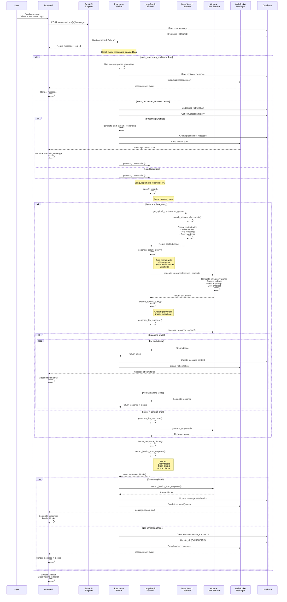
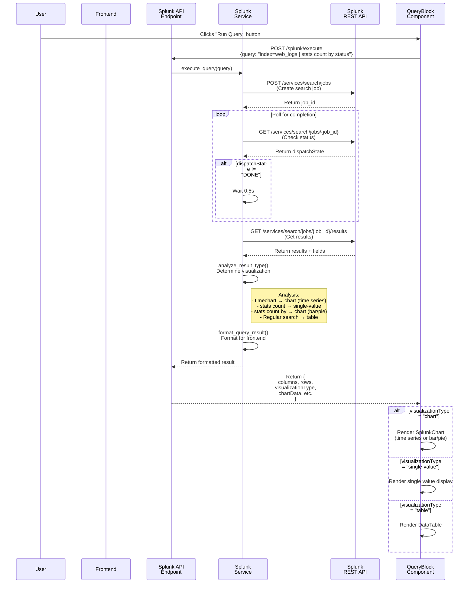
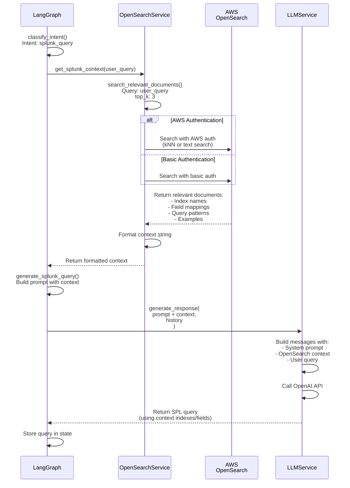

# Enterprise Chat Backend API

## Overview

This is the FastAPI backend for the Enterprise Chat UI application. It provides a RESTful API for managing conversations, messages, and async job processing. The backend integrates with LangGraph for intelligent conversation flow, OpenAI for LLM responses, AWS OpenSearch for context retrieval, and Splunk for query execution.

## Features

- **Intelligent Conversation Flow**: LangGraph-based state machine for routing and processing conversations
- **LLM Integration**: OpenAI integration with streaming support for real-time responses
- **Context Retrieval**: AWS OpenSearch integration for retrieving relevant documents during query generation
- **Splunk Integration**: Execute Splunk queries and automatically determine visualization types
- **Real-time Updates**: WebSocket support for streaming responses and live updates
- **Async Job Processing**: Background job system for long-running tasks
- **Mock Mode**: Fallback to mock responses when LLM services are unavailable

## Architecture

### High-Level Architecture

```
┌─────────────┐
│   Frontend  │
│  (React)    │
└──────┬──────┘
       │ HTTP/WebSocket
       ▼
┌─────────────────────────────────────┐
│         FastAPI Backend              │
│  ┌───────────────────────────────┐  │
│  │      API Endpoints            │  │
│  │  - /conversations             │  │
│  │  - /splunk/execute           │  │
│  │  - /jobs                     │  │
│  │  - /ws (WebSocket)            │  │
│  └───────────┬───────────────────┘  │
│              │                       │
│  ┌───────────▼───────────────────┐  │
│  │    LangGraph Service          │  │
│  │  - Intent Classification      │  │
│  │  - Query Generation           │  │
│  │  - Response Generation        │  │
│  └───────────┬───────────────────┘  │
│              │                       │
│  ┌───────────▼───────────────────┐  │
│  │    Service Layer              │  │
│  │  - LLM Service                │  │
│  │  - OpenSearch Service         │  │
│  │  - Splunk Service             │  │
│  │  - WebSocket Manager          │  │
│  └───────────┬───────────────────┘  │
│              │                       │
│  ┌───────────▼───────────────────┐  │
│  │    Database (SQLite)          │  │
│  │  - Conversations              │  │
│  │  - Messages                   │  │
│  │  - Jobs                       │  │
│  └───────────────────────────────┘  │
└─────────────────────────────────────┘
       │
       ▼
┌─────────────┐  ┌──────────────┐  ┌─────────────┐
│   OpenAI    │  │ OpenSearch   │  │   Splunk    │
│     API     │  │   (AWS)      │  │     API     │
└─────────────┘  └──────────────┘  └─────────────┘
```

## Sequence Diagrams

### 1. Message Flow with LangGraph and Streaming



### 2. Splunk Query Execution Flow



### 3. OpenSearch Context Retrieval Flow



## Project Structure

```
backend/
├── app/
│   ├── api/                    # FastAPI route handlers
│   │   ├── auth.py            # Authentication endpoints
│   │   ├── conversations.py   # Conversation & message endpoints
│   │   ├── jobs.py            # Job management endpoints
│   │   ├── splunk.py          # Splunk query execution endpoint
│   │   └── websocket.py       # WebSocket connection handler
│   │
│   ├── core/                   # Core configuration & utilities
│   │   ├── config.py          # Application settings (Pydantic)
│   │   ├── database.py        # SQLModel database setup
│   │   ├── auth.py            # Authentication utilities
│   │   ├── event_bus.py       # In-memory event bus
│   │   └── redis_client.py    # Redis client (optional)
│   │
│   ├── models/                 # SQLModel database models
│   │   ├── conversation.py    # Conversation model
│   │   ├── message.py         # Message model
│   │   └── job.py             # Job model
│   │
│   ├── services/               # Business logic services
│   │   ├── langgraph_service.py    # LangGraph conversation flow
│   │   ├── llm_service.py          # OpenAI LLM integration
│   │   ├── opensearch_service.py   # AWS OpenSearch integration
│   │   ├── splunk_service.py       # Splunk query execution
│   │   ├── websocket_manager.py    # WebSocket connection management
│   │   ├── job_service.py          # Job management service
│   │   ├── job_listener.py         # Background job listener
│   │   └── sso_service.py          # SSO authentication
│   │
│   └── workers/                # Background workers
│       ├── response_worker.py      # Assistant response generation
│       └── chart_worker.py         # Chart generation worker
│
├── main.py                     # FastAPI application entry point
├── requirements.txt            # Python dependencies
├── pytest.ini                 # Pytest configuration
└── README.md                   # This file
```

## Configuration

### Environment Variables

Create a `.env` file in the backend directory with the following variables:

```bash
# Database
DATABASE_URL=sqlite:///./data/chat.db

# Authentication
AUTH_ENABLED=false
SECRET_KEY=dev-secret-key-change-me
DEFAULT_USER=anonymous

# CORS
CORS_ORIGINS=["http://localhost:5173","http://localhost:3000"]

# API Behavior
MOCK_RESPONSES_ENABLED=false

# OpenAI Configuration
OPENAI_API_KEY=your-openai-api-key
OPENAI_MODEL=gpt-4
STREAMING_ENABLED=true
MAX_CONVERSATION_HISTORY=10

# AWS OpenSearch Configuration
OPENSEARCH_HOST=search-domain.us-east-1.es.amazonaws.com
OPENSEARCH_INDEX=splunk-knowledge-base
OPENSEARCH_REGION=us-east-1
OPENSEARCH_USE_AWS_AUTH=true
OPENSEARCH_CONTEXT_TOP_K=3

# Splunk Configuration
SPLUNK_HOST=splunk.example.com
SPLUNK_PORT=8089
SPLUNK_USERNAME=admin
SPLUNK_PASSWORD=your-password
SPLUNK_VERIFY_SSL=true

# SSO Configuration (optional)
SSO_ENABLED=false
SSO_PROVIDER=saml  # or oauth2, oidc
```

### Configuration File

All configuration is managed through `app/core/config.py` using Pydantic Settings. Settings are loaded from:
1. Environment variables
2. `.env` file
3. Default values

## API Endpoints

### Conversations

- `GET /conversations` - Get all conversations
- `POST /conversations` - Create a new conversation
- `DELETE /conversations/{id}` - Delete a conversation
- `GET /conversations/{id}/messages` - Get messages for a conversation
- `POST /conversations/{id}/messages` - Create a message (triggers async response generation)

### Splunk

- `POST /splunk/execute` - Execute a Splunk query and return formatted results

**Request:**
```json
{
  "query": "index=web_logs | stats count by status",
  "earliest_time": "-1h@h",
  "latest_time": "now",
  "language": "spl"
}
```

**Response:**
```json
{
  "columns": ["status", "count"],
  "rows": [["Success", 1250], ["Error", 75]],
  "rowCount": 2,
  "visualizationType": "chart",
  "visualizationConfig": {
    "chartType": "bar",
    "xAxis": "status",
    "yAxis": "count"
  },
  "chartData": [
    {"name": "Success", "value": 1250},
    {"name": "Error", "value": 75}
  ],
  "isTimeSeries": false,
  "allowChartTypeSwitch": true
}
```

### Jobs

- `GET /jobs` - Get all jobs
- `GET /jobs/{job_id}` - Get job status
- `POST /jobs` - Create a new job

### WebSocket

- `WS /ws` - WebSocket connection for real-time updates

**Message Types:**
- `message.new` - New message received
- `message.stream.start` - Streaming response started
- `message.stream.token` - Token received during streaming
- `message.stream.chunk` - Chunk received during streaming
- `message.stream.end` - Streaming response completed
- `job.update` - Job status update

### Health & Metrics

- `GET /` - Root endpoint
- `GET /health` - Health check
- `GET /metrics` - Metrics endpoint

## Services

### LangGraph Service (`app/services/langgraph_service.py`)

Implements the conversation state machine using LangGraph. Key components:

**State Machine Nodes:**
1. `classify_intent` - Determines user intent (splunk_query, general_chat, etc.)
2. `generate_splunk_query` - Converts natural language to SPL with OpenSearch context
3. `execute_splunk_query` - Executes Splunk query (creates query block)
4. `generate_llm_response` - Generates AI response using OpenAI
5. `generate_mock_response` - Fallback to mock responses
6. `format_response_blocks` - Extracts and formats blocks from response

**Routing Logic:**
- If `mock_responses_enabled=True`: Always route to `generate_mock_response`
- If intent is `splunk_query`: Route through OpenSearch → Query generation → LLM
- Otherwise: Route directly to LLM response generation

### LLM Service (`app/services/llm_service.py`)

Wrapper for OpenAI API interactions:

**Key Methods:**
- `generate_response_stream()` - Stream tokens asynchronously
- `generate_response()` - Generate complete response
- `extract_blocks_from_response()` - Parse LLM response to extract structured blocks
- `build_prompt()` - Construct prompts with conversation history

**Block Extraction:**
Automatically extracts:
- Splunk queries (SPL)
- SQL queries
- Code blocks
- Chart requests
- Table data

### OpenSearch Service (`app/services/opensearch_service.py`)

AWS OpenSearch integration for context retrieval:

**Key Methods:**
- `search_relevant_documents()` - Vector/text search for relevant documents
- `get_splunk_context()` - Format context for Splunk query generation

**Context Format:**
Returns formatted string with:
- Index names and descriptions
- Field mappings
- Example queries
- Best practices

### Splunk Service (`app/services/splunk_service.py`)

Splunk query execution and result analysis:

**Key Methods:**
- `execute_query()` - Execute SPL query via Splunk REST API
- `analyze_result_type()` - Determine visualization type from results
- `format_query_result()` - Format results for frontend consumption

**Visualization Detection:**
- `timechart` → Time series chart
- `stats count` (no `by`) → Single value
- `stats ... by` → Bar/pie chart
- Regular search → Data table

### WebSocket Manager (`app/services/websocket_manager.py`)

Manages WebSocket connections and streaming:

**Key Methods:**
- `broadcast()` - Broadcast message to all connected clients
- `send_stream_start()` - Signal streaming start
- `stream_token()` - Send individual token
- `stream_chunk()` - Send chunk of tokens
- `send_stream_end()` - Signal streaming completion

## Workers

### Response Worker (`app/workers/response_worker.py`)

Generates assistant responses asynchronously:

**Flow:**
1. Check `mock_responses_enabled` flag
2. If mock: Use existing mock response generation
3. If LLM: Use LangGraph to process conversation
4. If streaming: Stream tokens via WebSocket
5. Save message and broadcast via WebSocket

**Streaming Support:**
- Creates placeholder message
- Streams tokens as they arrive from LLM
- Updates message content incrementally
- Extracts blocks at completion
- Finalizes message with blocks

## Setup Instructions

### Prerequisites

- Python 3.11+
- pip
- (Optional) Virtual environment

### Installation

1. **Clone the repository and navigate to backend:**
```bash
cd enterprise-chat-ui/backend
```

2. **Create virtual environment (recommended):**
```bash
python -m venv venv
source venv/bin/activate  # On Windows: venv\Scripts\activate
```

3. **Install dependencies:**
```bash
pip install -r requirements.txt
```

4. **Create `.env` file:**
```bash
cp .env.example .env  # If exists, or create manually
# Edit .env with your configuration
```

5. **Initialize database:**
```bash
python scripts/init_db.py
```

6. **Run the server:**
```bash
python -m uvicorn main:app --reload --host 0.0.0.0 --port 8000
```

The API will be available at `http://localhost:8000`

### API Documentation

Once the server is running, visit:
- Swagger UI: `http://localhost:8000/docs`
- ReDoc: `http://localhost:8000/redoc`

## Dependencies

### Core Dependencies

- **fastapi** (0.115.2) - Web framework
- **uvicorn** (0.30.5) - ASGI server
- **sqlmodel** (0.0.16) - SQL database ORM
- **pydantic** (2.9.2) - Data validation
- **pydantic-settings** (2.5.2) - Settings management

### AI/ML Dependencies

- **langchain** (>=0.2.0) - LLM framework
- **langchain-openai** (>=0.1.0) - OpenAI integration
- **langgraph** (>=1.0.0) - State machine for conversations
- **langchain-core** (>=0.3.0) - Core LangChain functionality
- **openai** (>=2.0.0) - OpenAI API client

### Integration Dependencies

- **opensearch-py** (2.4.0) - AWS OpenSearch client
- **boto3** (1.34.0) - AWS SDK
- **aws-requests-auth** (0.4.3) - AWS request signing
- **requests** (>=2.32.0) - HTTP client (for Splunk)

### Development Dependencies

- **pytest** (8.3.3) - Testing framework
- **pytest-asyncio** (0.24.0) - Async test support

## Code Flow Examples

### Example 1: User Sends Message (Mock Mode)

```
1. User sends "hello"
2. Frontend → POST /conversations/{id}/messages
3. API creates message and job
4. Response Worker checks mock_responses_enabled=True
5. Uses _generate_assistant_response() from conversations.py
6. Generates mock response with blocks
7. Saves message and broadcasts via WebSocket
8. Frontend receives message.new event
9. Renders message with blocks
```

### Example 2: User Sends Splunk Query (LLM Mode with Streaming)

```
1. User sends "show me errors in web logs"
2. Frontend → POST /conversations/{id}/messages
3. API creates message and job
4. Response Worker checks mock_responses_enabled=False
5. Checks streaming_enabled=True and LLM available
6. Creates placeholder message
7. Sends stream.start via WebSocket
8. LangGraph classifies intent: splunk_query
9. OpenSearch retrieves context about web_logs index
10. LangGraph generates SPL query with context
11. LLM streams response tokens
12. Each token sent via WebSocket (stream.token)
13. Frontend accumulates tokens in real-time
14. LLM extracts blocks from response
15. Sends stream.end with blocks
16. Frontend finalizes message and renders blocks
```

### Example 3: Execute Splunk Query

```
1. User clicks "Run Query" on QueryBlock
2. Frontend → POST /splunk/execute {query: "index=web_logs | stats count by status"}
3. Splunk Service creates search job
4. Polls job status until DONE
5. Retrieves results from Splunk
6. Analyzes result type: stats count by → chart
7. Formats results with chartData
8. Returns to frontend
9. QueryBlock renders SplunkChart component
```

## Testing

Run tests with pytest:

```bash
pytest
```

Run specific test file:

```bash
pytest tests/test_messages.py
```

## Troubleshooting

### Common Issues

1. **ModuleNotFoundError**: Install missing dependencies with `pip install -r requirements.txt`

2. **LangGraph Import Errors**: Ensure compatible versions:
   - `langchain-core >= 0.3.0`
   - `langgraph >= 1.0.0`
   - `langchain >= 0.2.0`

3. **OpenSearch Connection Issues**: 
   - Verify AWS credentials are configured
   - Check OPENSEARCH_HOST and OPENSEARCH_INDEX settings
   - Ensure network access to OpenSearch cluster

4. **Splunk Connection Issues**:
   - Verify SPLUNK_HOST, SPLUNK_USERNAME, SPLUNK_PASSWORD
   - Check Splunk management port (default: 8089)
   - Ensure SSL certificate verification if using HTTPS

5. **WebSocket Connection Issues**:
   - Check CORS settings in config
   - Verify WebSocket URL matches frontend configuration
   - Check firewall/network settings

## Development

### Adding New Services

1. Create service file in `app/services/`
2. Add initialization in service file
3. Import and use in appropriate worker or API endpoint

### Adding New API Endpoints

1. Create endpoint file in `app/api/`
2. Define router with `APIRouter`
3. Register router in `main.py`

### Adding New LangGraph Nodes

1. Define node function in `langgraph_service.py`
2. Add node to graph in `create_conversation_graph()`
3. Add routing logic if needed

## License

[Add your license information here]

## Contributing

[Add contribution guidelines here]

