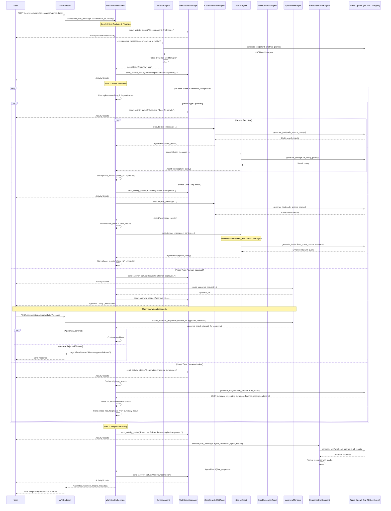
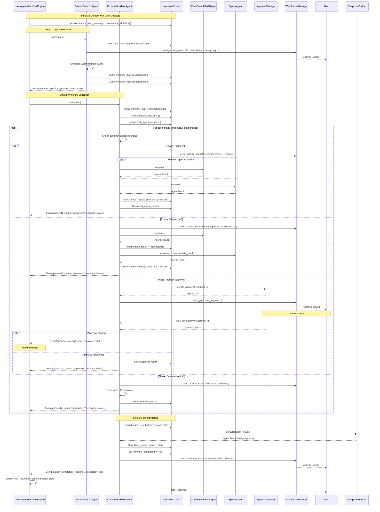
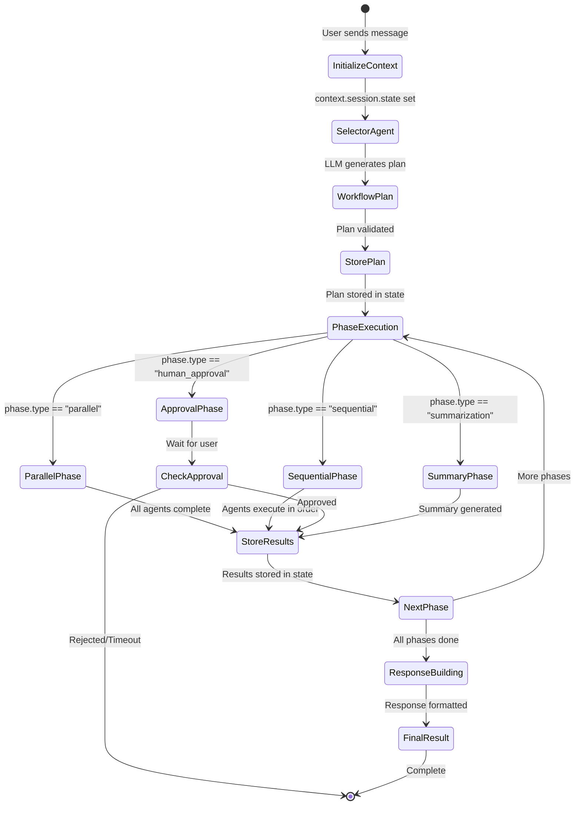
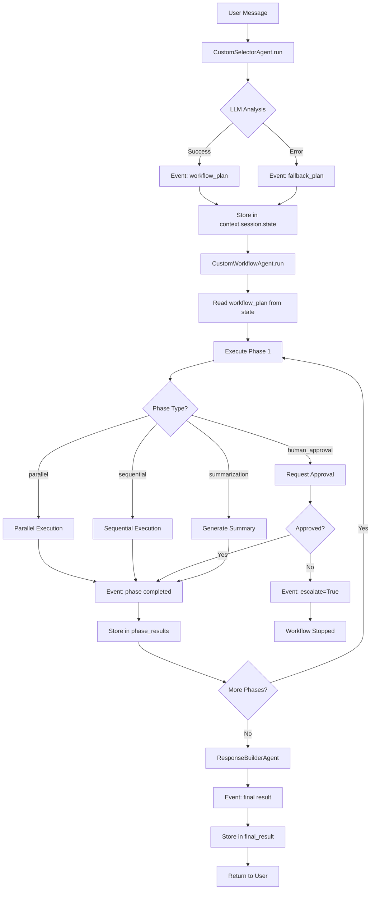
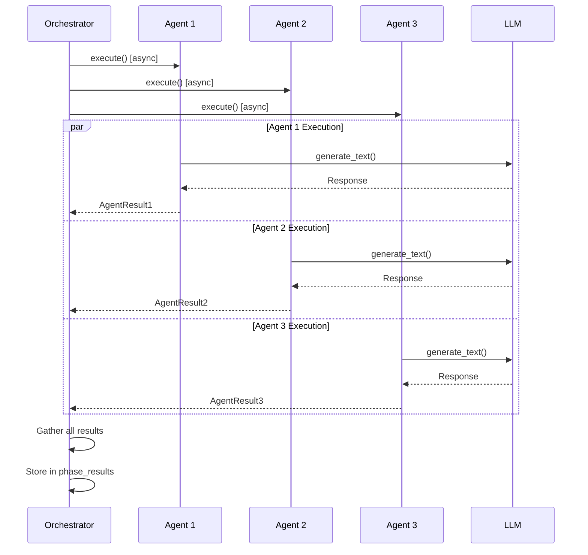
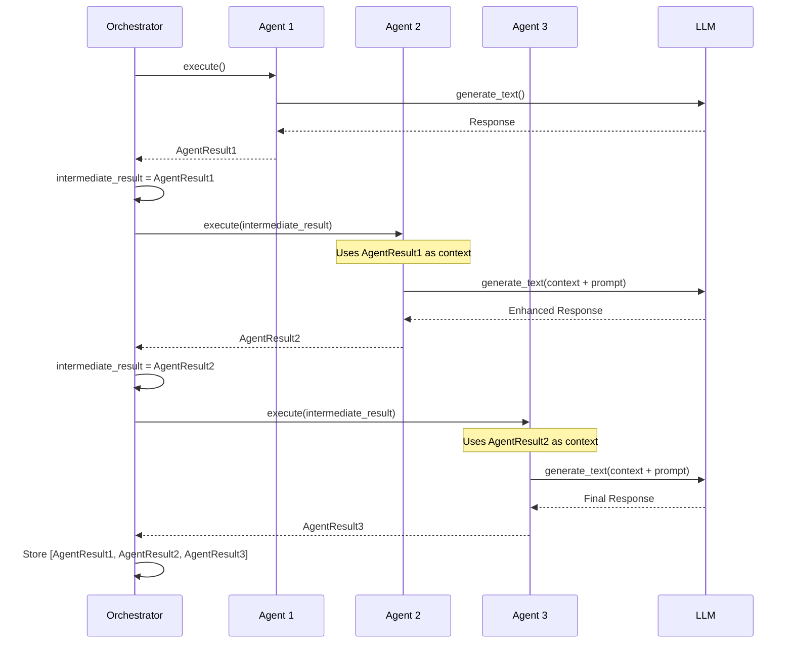
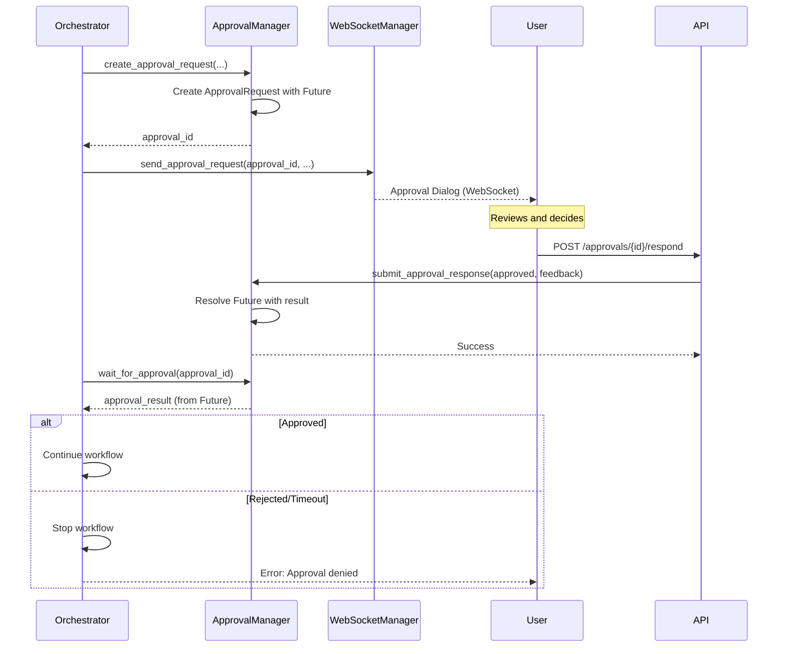
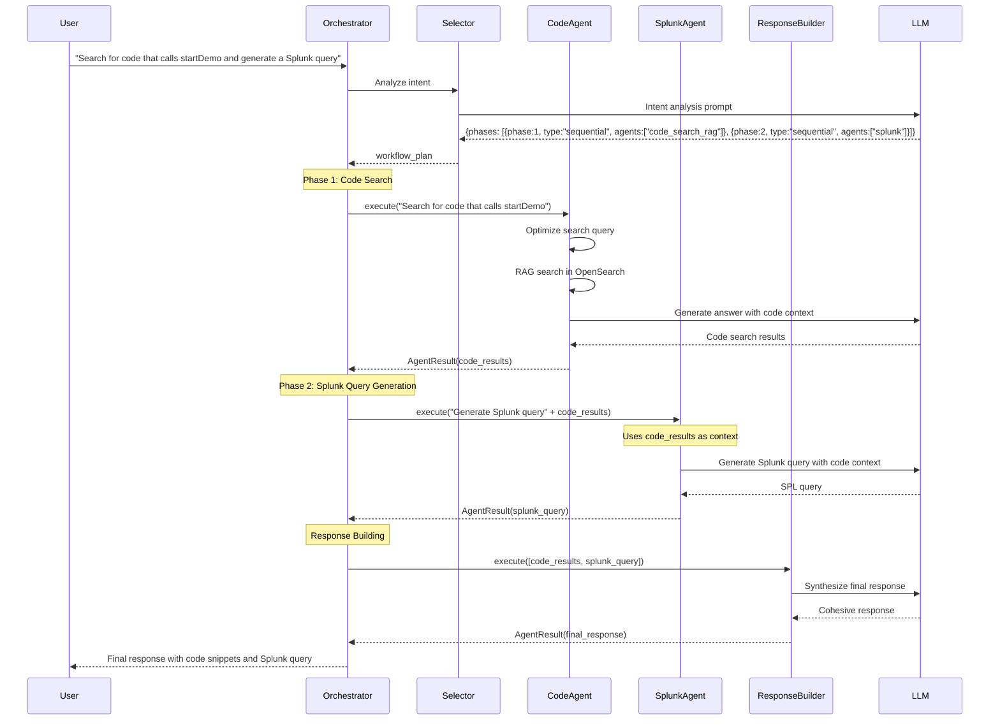

# Workflow Agent Sequence Diagram

## Workflow Orchestrator Execution Flow

This document shows the sequence diagram of how the `WorkflowOrchestrator` (and `CustomWorkflowAgent`) executes workflows.

## Custom Workflow Agent Sequence Diagram

This shows how `CustomWorkflowAgent` works with event-driven architecture:

## Key Differences: Standard vs Custom Agents

### Standard WorkflowOrchestrator
- Direct method calls
- Returns `AgentResult` directly
- Synchronous-style execution
- State passed as parameters

### Custom Workflow Agent
- Event-driven architecture
- Yields `Event` objects
- Uses `InvocationContext.session.state` for persistence
- `EventActions(escalate=True)` stops workflow
- `EventActions(escalate=False)` continues workflow

## State Flow

## Event Flow Diagram

## Phase Execution Details

### Parallel Phase Execution

### Sequential Phase Execution

### Human Approval Phase

## Complete Workflow Example

### Example: "Search code and generate Splunk query"

