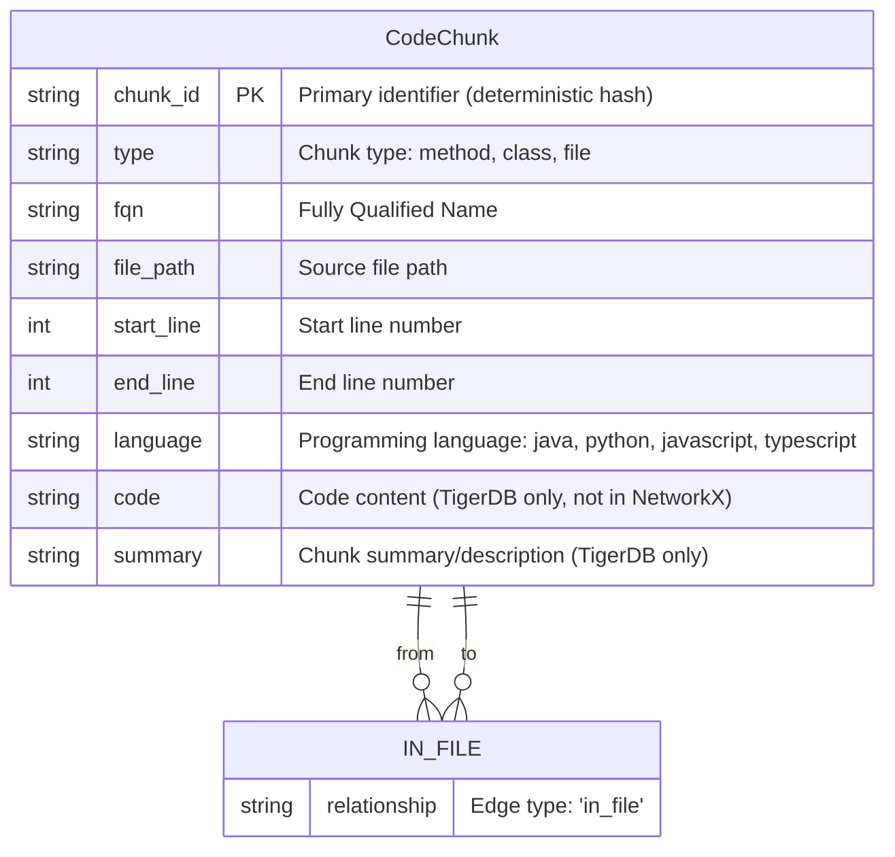
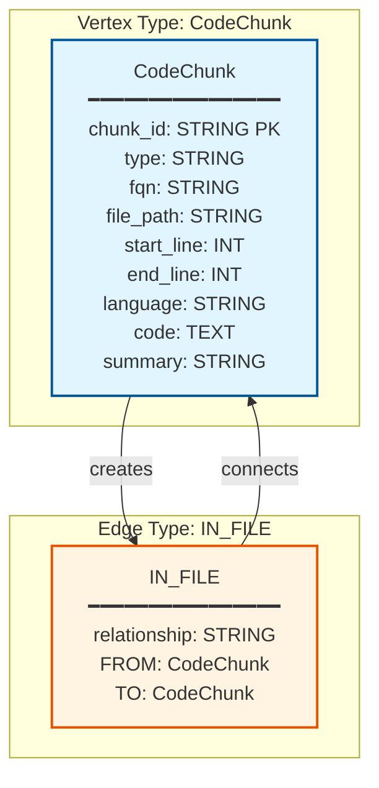
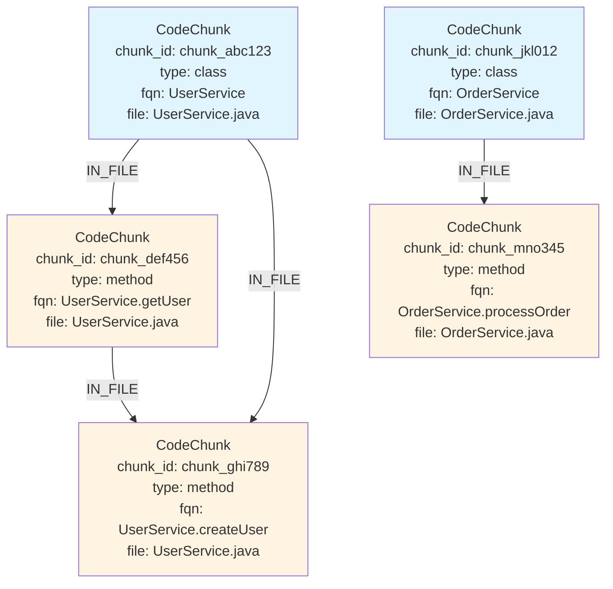

# Graph Schema Documentation

## Overview

The code knowledge graph represents code chunks and their relationships. The graph is built using NetworkX (in-memory) and can be ported to TigerDB/TigerGraph for persistent storage and advanced queries.

## Graph Schema Diagram

### Entity Relationship Diagram



### Simplified Schema Visualization



## Entity Relationship Details

### Vertex: CodeChunk

**Description**: Represents a code chunk extracted from source files.

**Attributes**:

| Attribute | Type | Description | NetworkX | TigerDB |
|-----------|------|-------------|----------|---------|
| `chunk_id` | STRING | Primary identifier (deterministic hash) | Node ID | PRIMARY_ID |
| `type` | STRING | Chunk type: `method`, `class`, or `file` | ✓ | ✓ |
| `fqn` | STRING | Fully Qualified Name (e.g., `UserService.getUser`) | ✓ | ✓ |
| `file_path` | STRING | Source file path | ✓ | ✓ |
| `start_line` | INT | Start line number in source file | ✓ | ✓ |
| `end_line` | INT | End line number in source file | ✓ | ✓ |
| `language` | STRING | Programming language (`java`, `python`, `javascript`, `typescript`) | ✓ | ✓ |
| `code` | TEXT | Code content | ✗ | ✓ |
| `summary` | STRING | Chunk summary/description | ✗ | ✓ |

**Chunk Types**:
- **`method`**: Individual method/function chunks
- **`class`**: Class metadata chunks (signature, fields, static blocks)
- **`file`**: Entire file chunks (for small files in hybrid strategy)

### Edge: IN_FILE

**Description**: Directed edge connecting code chunks that belong to the same source file.

**Attributes**:

| Attribute | Type | Description |
|-----------|------|-------------|
| `relationship` | STRING | Always `'in_file'` |

**Semantics**:
- **From**: Source chunk
- **To**: Target chunk
- **Meaning**: Both chunks are in the same file
- **Direction**: Directed (chunk1 → chunk2)

## Graph Structure Example



**Legend**:
- 🔵 Blue nodes: Class chunks
- 🟡 Yellow nodes: Method chunks
- Arrows: IN_FILE relationships (same file)

## NetworkX Implementation

**Graph Type**: `networkx.MultiDiGraph` (Directed graph with multiple edges)

**Node Structure**:
```python
{
    'chunk_id': 'chunk_abc123',  # Node ID
    'type': 'method',
    'fqn': 'UserService.getUser',
    'file_path': '/path/to/UserService.java',
    'start_line': 10,
    'end_line': 25,
    'language': 'java'
}
```

**Edge Structure**:
```python
{
    'relationship': 'in_file'
}
```

## TigerDB/TigerGraph Schema

### Vertex Type Definition

```sql
CREATE VERTEX CodeChunk (
    PRIMARY_ID chunk_id STRING,
    fqn STRING,
    type STRING,
    file_path STRING,
    start_line INT,
    end_line INT,
    code TEXT,
    summary STRING,
    language STRING
)
```

### Edge Type Definition

```sql
CREATE DIRECTED EDGE IN_FILE (
    FROM CodeChunk,
    TO CodeChunk,
    relationship STRING
)
```

### Graph Definition

```sql
CREATE GRAPH code_knowledge_graph (
    CodeChunk,
    IN_FILE
)
```

## Graph Building Logic

### Node Creation

1. **For each chunk**:
   - Create node with `chunk_id` as node ID
   - Add attributes: `type`, `fqn`, `file_path`, `start_line`, `end_line`, `language`

### Edge Creation

1. **For each pair of chunks**:
   - If `chunk1['file_path'] == chunk2['file_path']`:
     - Create directed edge: `chunk1['chunk_id'] → chunk2['chunk_id']`
     - Edge attribute: `relationship='in_file'`

### Current Limitations

- **Only file-level relationships**: Edges are created only between chunks in the same file
- **No cross-file relationships**: Method calls, imports, inheritance are not yet modeled
- **No semantic relationships**: No edges for "calls", "imports", "extends", "implements"

## Future Enhancements

Potential edge types to add:

1. **CALLS**: Method A calls Method B
2. **IMPORTS**: File A imports from File B
3. **EXTENDS**: Class A extends Class B
4. **IMPLEMENTS**: Class A implements Interface B
5. **DEPENDS_ON**: File A depends on File B
6. **REFERENCES**: Chunk A references Chunk B

## Usage Examples

### Query: Find all chunks in a file

```python
# NetworkX
file_chunks = [node for node, data in graph.nodes(data=True) 
               if data['file_path'] == 'UserService.java']

# TigerDB GSQL
SELECT * FROM CodeChunk WHERE file_path == "UserService.java"
```

### Query: Find related chunks (same file)

```python
# NetworkX
related = list(graph.successors(chunk_id))  # Chunks in same file

# TigerDB GSQL
SELECT tgt FROM CodeChunk src -(IN_FILE)-> CodeChunk tgt 
WHERE src.chunk_id == "chunk_abc123"
```

### Query: Find all methods in a class

```python
# NetworkX
class_chunk = [node for node, data in graph.nodes(data=True) 
               if data['fqn'] == 'UserService' and data['type'] == 'class'][0]
methods = [node for node in graph.successors(class_chunk)
           if graph.nodes[node]['type'] == 'method']
```

## Statistics

After building the graph, you can get statistics:

```python
stats = graph_builder.get_stats()
# Returns: {'nodes': 1000, 'edges': 2500}
```

**Typical ratios**:
- **Nodes**: One per code chunk
- **Edges**: ~2-3 edges per node (chunks in same file are all connected)

