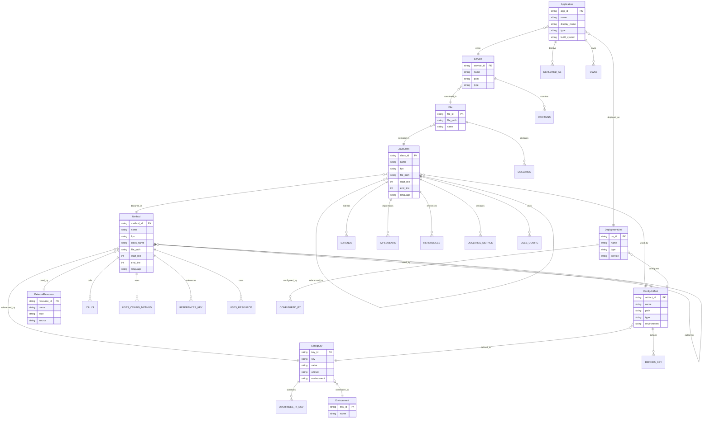
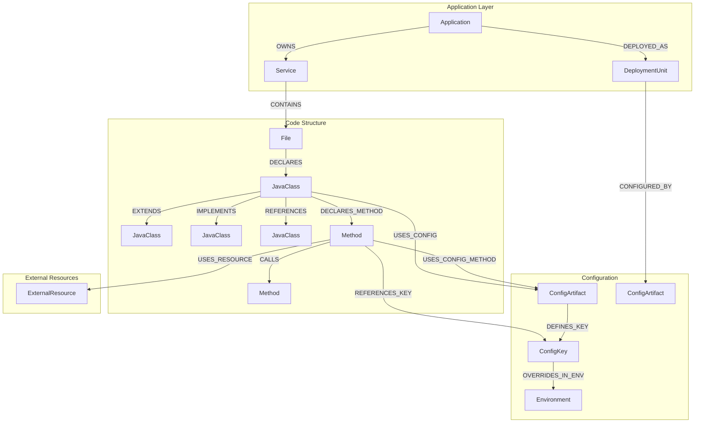
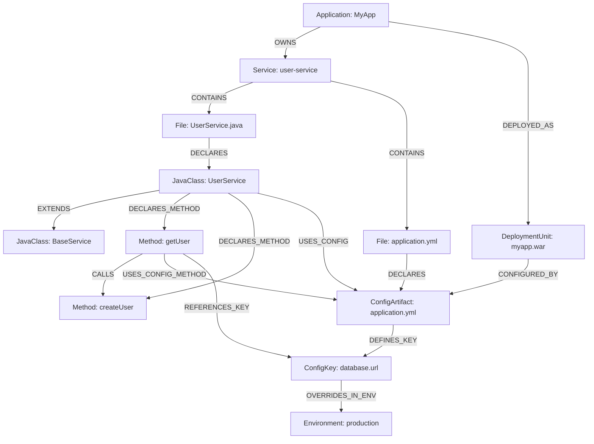

# Graph Schema Documentation

## Overview

The code knowledge graph represents software architecture, code structure, and relationships. The graph supports two modes:

1. **Simple Schema** (backward compatibility): CodeChunk vertices with IN_FILE edges
2. **Rich Schema** (default): Multiple entity types (Application, Service, File, Class, Method, Config, etc.) with comprehensive relationships

The graph is built using NetworkX (in-memory) and can be ported to TigerDB/TigerGraph for persistent storage and advanced queries.

## Graph Schema Modes

### Simple Schema (Legacy)

**Use**: `--use-simple-graph` flag

- **Vertices**: `CodeChunk` only
- **Edges**: `IN_FILE` (connects chunks in same file)

### Rich Schema (Default)

**Use**: `--use-rich-graph` flag (default)

- **10 Vertex Types**: Application, Service, File, JavaClass, Method, ConfigArtifact, ConfigKey, Environment, ExternalResource, DeploymentUnit
- **16 Edge Types**: Comprehensive relationships modeling software architecture

## Rich Schema Diagram

### Entity Relationship Diagram



### Simplified Schema Visualization



## Vertex Types

### Application

**Description**: Top-level application entity representing the entire software application.

**Attributes**:

| Attribute | Type | Description |
|-----------|------|-------------|
| `app_id` | STRING | Primary identifier |
| `name` | STRING | Application name (from pom.xml artifactId or package.json name) |
| `display_name` | STRING | Display name (from pom.xml name or package.json description) |
| `type` | STRING | Application type (`java`, `nodejs`, `python`, etc.) |
| `build_system` | STRING | Build system (`maven`, `npm`, `gradle`, etc.) |

### Service

**Description**: Service or module within an application (e.g., Maven module, microservice).

**Attributes**:

| Attribute | Type | Description |
|-----------|------|-------------|
| `service_id` | STRING | Primary identifier |
| `name` | STRING | Service name |
| `path` | STRING | File system path to service |
| `type` | STRING | Service type (`maven-module`, `nodejs-service`, `inferred`, etc.) |

### DeploymentUnit

**Description**: Deployment artifact (JAR, WAR, container, etc.).

**Attributes**:

| Attribute | Type | Description |
|-----------|------|-------------|
| `du_id` | STRING | Primary identifier |
| `name` | STRING | Deployment unit name (e.g., `myapp.war`) |
| `type` | STRING | Deployment type (`jar`, `war`, `nodejs`, etc.) |
| `service` | STRING | Associated service name |

### File

**Description**: Source code file.

**Attributes**:

| Attribute | Type | Description |
|-----------|------|-------------|
| `file_id` | STRING | Primary identifier (hash of file_path) |
| `file_path` | STRING | Full file path |
| `name` | STRING | File name (basename) |

### JavaClass

**Description**: Java class (or class in other languages).

**Attributes**:

| Attribute | Type | Description |
|-----------|------|-------------|
| `class_id` | STRING | Primary identifier |
| `name` | STRING | Class name |
| `fqn` | STRING | Fully Qualified Name |
| `file_path` | STRING | Source file path |
| `start_line` | INT | Start line number |
| `end_line` | INT | End line number |
| `language` | STRING | Programming language |

### Method

**Description**: Method or function.

**Attributes**:

| Attribute | Type | Description |
|-----------|------|-------------|
| `method_id` | STRING | Primary identifier |
| `name` | STRING | Method name |
| `fqn` | STRING | Fully Qualified Name (e.g., `UserService.getUser`) |
| `class_name` | STRING | Containing class name |
| `file_path` | STRING | Source file path |
| `start_line` | INT | Start line number |
| `end_line` | INT | End line number |
| `language` | STRING | Programming language |

### ConfigArtifact

**Description**: Configuration file (application.yml, application.properties, etc.).

**Attributes**:

| Attribute | Type | Description |
|-----------|------|-------------|
| `artifact_id` | STRING | Primary identifier |
| `name` | STRING | Config file name |
| `path` | STRING | Full file path |
| `type` | STRING | Config type (`yaml`, `properties`, `env`, etc.) |
| `environment` | STRING | Environment (`default`, `production`, `development`, `test`) |

### ConfigKey

**Description**: Configuration key-value pair.

**Attributes**:

| Attribute | Type | Description |
|-----------|------|-------------|
| `key_id` | STRING | Primary identifier |
| `key` | STRING | Configuration key (e.g., `database.url`) |
| `value` | STRING | Configuration value |
| `artifact` | STRING | Config artifact name |
| `environment` | STRING | Environment |

### Environment

**Description**: Environment (dev, prod, test, etc.).

**Attributes**:

| Attribute | Type | Description |
|-----------|------|-------------|
| `env_id` | STRING | Primary identifier |
| `name` | STRING | Environment name (`default`, `production`, `development`, `test`) |

### ExternalResource

**Description**: External system or resource (database, messaging queue, cache, etc.).

**Attributes**:

| Attribute | Type | Description |
|-----------|------|-------------|
| `resource_id` | STRING | Primary identifier |
| `name` | STRING | Resource name (e.g., `Oracle Database`, `Apache Kafka`) |
| `type` | STRING | Resource type (`database`, `messaging`, `cache`) |
| `source` | STRING | Source file or config where resource was identified |

**Note**: External resource extraction is currently disabled. The schema supports it, but extraction logic is commented out.

## Edge Types

### DEPLOYED_AS

- **From**: `Application`
- **To**: `DeploymentUnit`
- **Description**: Application is deployed as a deployment unit

### OWNS

- **From**: `Application`
- **To**: `Service`
- **Description**: Application owns a service/module

### CONTAINS

- **From**: `Service`
- **To**: `File`
- **Description**: Service contains source files

### DECLARES

- **From**: `File`
- **To**: `JavaClass`
- **Description**: File declares a class

### EXTENDS

- **From**: `JavaClass`
- **To**: `JavaClass`
- **Description**: Class extends another class (inheritance)

### IMPLEMENTS

- **From**: `JavaClass`
- **To**: `JavaClass`
- **Description**: Class implements an interface

### REFERENCES

- **From**: `JavaClass`
- **To**: `JavaClass`
- **Description**: Class references another class (general reference)

### DECLARES_METHOD

- **From**: `JavaClass`
- **To**: `Method`
- **Description**: Class declares a method

### CALLS

- **From**: `Method`
- **To**: `Method`
- **Description**: Method calls another method

### USES_CONFIG

- **From**: `JavaClass`
- **To**: `ConfigArtifact`
- **Description**: Class uses a configuration artifact

### USES_CONFIG_METHOD

- **From**: `Method`
- **To**: `ConfigArtifact`
- **Description**: Method uses a configuration artifact

### REFERENCES_KEY

- **From**: `Method`
- **To**: `ConfigKey`
- **Description**: Method references a configuration key

### DEFINES_KEY

- **From**: `ConfigArtifact`
- **To**: `ConfigKey`
- **Description**: Config artifact defines a configuration key

### OVERRIDES_IN_ENV

- **From**: `ConfigKey`
- **To**: `Environment`
- **Description**: Config key is overridden in an environment

### CONFIGURED_BY

- **From**: `DeploymentUnit`
- **To**: `ConfigArtifact`
- **Description**: Deployment unit is configured by a config artifact

### USES_RESOURCE

- **From**: `Method`
- **To**: `ExternalResource`
- **Description**: Method uses an external resource

**Note**: External resource relationships are currently disabled. The schema supports it, but relationship creation is commented out.

## Graph Structure Example



## TigerDB/TigerGraph Schema

### Rich Schema Vertex Types

```sql
CREATE VERTEX Application (
    PRIMARY_ID app_id STRING,
    name STRING,
    display_name STRING,
    type STRING,
    build_system STRING
)

CREATE VERTEX Service (
    PRIMARY_ID service_id STRING,
    name STRING,
    path STRING,
    type STRING
)

CREATE VERTEX DeploymentUnit (
    PRIMARY_ID du_id STRING,
    name STRING,
    type STRING,
    service STRING
)

CREATE VERTEX File (
    PRIMARY_ID file_id STRING,
    file_path STRING,
    name STRING
)

CREATE VERTEX JavaClass (
    PRIMARY_ID class_id STRING,
    name STRING,
    fqn STRING,
    file_path STRING,
    start_line INT,
    end_line INT,
    language STRING
)

CREATE VERTEX Method (
    PRIMARY_ID method_id STRING,
    name STRING,
    fqn STRING,
    class_name STRING,
    file_path STRING,
    start_line INT,
    end_line INT,
    language STRING
)

CREATE VERTEX ConfigArtifact (
    PRIMARY_ID artifact_id STRING,
    name STRING,
    path STRING,
    type STRING,
    environment STRING
)

CREATE VERTEX ConfigKey (
    PRIMARY_ID key_id STRING,
    key STRING,
    value STRING,
    artifact STRING,
    environment STRING
)

CREATE VERTEX Environment (
    PRIMARY_ID env_id STRING,
    name STRING
)

CREATE VERTEX ExternalResource (
    PRIMARY_ID resource_id STRING,
    name STRING,
    type STRING,
    source STRING
)
```

### Rich Schema Edge Types

```sql
CREATE DIRECTED EDGE DEPLOYED_AS (
    FROM Application,
    TO DeploymentUnit,
    relationship STRING
)

CREATE DIRECTED EDGE OWNS (
    FROM Application,
    TO Service,
    relationship STRING
)

CREATE DIRECTED EDGE CONTAINS (
    FROM Service,
    TO File,
    relationship STRING
)

CREATE DIRECTED EDGE DECLARES (
    FROM File,
    TO JavaClass,
    relationship STRING
)

CREATE DIRECTED EDGE EXTENDS (
    FROM JavaClass,
    TO JavaClass,
    relationship STRING
)

CREATE DIRECTED EDGE IMPLEMENTS (
    FROM JavaClass,
    TO JavaClass,
    relationship STRING
)

CREATE DIRECTED EDGE REFERENCES (
    FROM JavaClass,
    TO JavaClass,
    relationship STRING
)

CREATE DIRECTED EDGE DECLARES_METHOD (
    FROM JavaClass,
    TO Method,
    relationship STRING
)

CREATE DIRECTED EDGE CALLS (
    FROM Method,
    TO Method,
    relationship STRING
)

CREATE DIRECTED EDGE USES_CONFIG (
    FROM JavaClass,
    TO ConfigArtifact,
    relationship STRING
)

CREATE DIRECTED EDGE USES_CONFIG_METHOD (
    FROM Method,
    TO ConfigArtifact,
    relationship STRING
)

CREATE DIRECTED EDGE REFERENCES_KEY (
    FROM Method,
    TO ConfigKey,
    relationship STRING
)

CREATE DIRECTED EDGE DEFINES_KEY (
    FROM ConfigArtifact,
    TO ConfigKey,
    relationship STRING
)

CREATE DIRECTED EDGE OVERRIDES_IN_ENV (
    FROM ConfigKey,
    TO Environment,
    relationship STRING
)

CREATE DIRECTED EDGE CONFIGURED_BY (
    FROM DeploymentUnit,
    TO ConfigArtifact,
    relationship STRING
)

CREATE DIRECTED EDGE USES_RESOURCE (
    FROM Method,
    TO ExternalResource,
    relationship STRING
)
```

### Graph Definition

```sql
CREATE GRAPH code_knowledge_graph (
    Application,
    Service,
    DeploymentUnit,
    File,
    JavaClass,
    Method,
    ConfigArtifact,
    ConfigKey,
    Environment,
    ExternalResource,
    DEPLOYED_AS,
    OWNS,
    CONTAINS,
    DECLARES,
    EXTENDS,
    IMPLEMENTS,
    REFERENCES,
    DECLARES_METHOD,
    CALLS,
    USES_CONFIG,
    USES_CONFIG_METHOD,
    REFERENCES_KEY,
    DEFINES_KEY,
    OVERRIDES_IN_ENV,
    CONFIGURED_BY,
    USES_RESOURCE
)
```

## Simple Schema (Backward Compatibility)

### Vertex Type: CodeChunk

```sql
CREATE VERTEX CodeChunk (
    PRIMARY_ID chunk_id STRING,
    fqn STRING,
    type STRING,
    file_path STRING,
    start_line INT,
    end_line INT,
    code TEXT,
    summary STRING,
    language STRING
)
```

### Edge Type: IN_FILE

```sql
CREATE DIRECTED EDGE IN_FILE (
    FROM CodeChunk,
    TO CodeChunk,
    relationship STRING
)
```

## Usage Examples

### Query: Find all methods in a class

```python
# NetworkX (Rich Schema)
class_id = "class_abc123"
methods = [node for node in graph.successors(class_id)
           if graph.nodes[node].get('entity_type') == 'Method'
           and any(e.get('relationship') == 'DECLARES_METHOD' 
                   for _, _, e in graph.edges(class_id, data=True))]

# TigerDB GSQL
SELECT tgt FROM JavaClass src -(DECLARES_METHOD)-> Method tgt 
WHERE src.class_id == "class_abc123"
```

### Query: Find all classes that extend a base class

```python
# NetworkX (Rich Schema)
base_class_id = "class_base123"
subclasses = [node for node in graph.predecessors(base_class_id)
              if any(e.get('relationship') == 'EXTENDS' 
                     for _, _, e in graph.edges(node, base_class_id, data=True))]

# TigerDB GSQL
SELECT src FROM JavaClass src -(EXTENDS)-> JavaClass tgt 
WHERE tgt.class_id == "class_base123"
```

### Query: Find all methods that call a specific method

```python
# NetworkX (Rich Schema)
target_method_id = "method_xyz789"
callers = [node for node in graph.predecessors(target_method_id)
           if any(e.get('relationship') == 'CALLS' 
                  for _, _, e in graph.edges(node, target_method_id, data=True))]

# TigerDB GSQL
SELECT src FROM Method src -(CALLS)-> Method tgt 
WHERE tgt.method_id == "method_xyz789"
```

### Query: Find all config keys used by a method

```python
# NetworkX (Rich Schema)
method_id = "method_abc123"
config_keys = [node for node in graph.successors(method_id)
               if graph.nodes[node].get('entity_type') == 'ConfigKey'
               and any(e.get('relationship') == 'REFERENCES_KEY' 
                       for _, _, e in graph.edges(method_id, node, data=True))]

# TigerDB GSQL
SELECT tgt FROM Method src -(REFERENCES_KEY)-> ConfigKey tgt 
WHERE src.method_id == "method_abc123"
```

### Query: Find all services in an application

```python
# NetworkX (Rich Schema)
app_id = "app_myapp"
services = [node for node in graph.successors(app_id)
            if graph.nodes[node].get('entity_type') == 'Service'
            and any(e.get('relationship') == 'OWNS' 
                    for _, _, e in graph.edges(app_id, node, data=True))]

# TigerDB GSQL
SELECT tgt FROM Application src -(OWNS)-> Service tgt 
WHERE src.app_id == "app_myapp"
```

## Statistics

After building the graph, you can get statistics:

```python
stats = graph_builder.get_stats()
# Returns: {'nodes': 5000, 'edges': 12000}
```

**Typical ratios** (Rich Schema):
- **Nodes**: Multiple types (Application: 1, Services: 1-10, Files: 100-1000, Classes: 500-5000, Methods: 2000-20000)
- **Edges**: ~2-3 edges per node on average

## Command-Line Options

### Rich Schema (Default)

```bash
python standalone_build_repo_independent.py \
  --repo-path /path/to/repo \
  --use-rich-graph
```

### Simple Schema (Backward Compatibility)

```bash
python standalone_build_repo_independent.py \
  --repo-path /path/to/repo \
  --use-simple-graph
```

## Notes

- **ExternalResource extraction is disabled**: The schema supports ExternalResource vertices and USES_RESOURCE edges, but the extraction logic is currently commented out. This can be re-enabled in the future.

- **Configuration relationships**: Some relationships (like USES_CONFIG, REFERENCES_KEY) are created based on file proximity and code analysis. More sophisticated analysis can be added later.

- **Language support**: While the schema uses "JavaClass", it supports classes from other languages (Python, JavaScript, TypeScript, etc.). The entity type name is kept as "JavaClass" for consistency.
