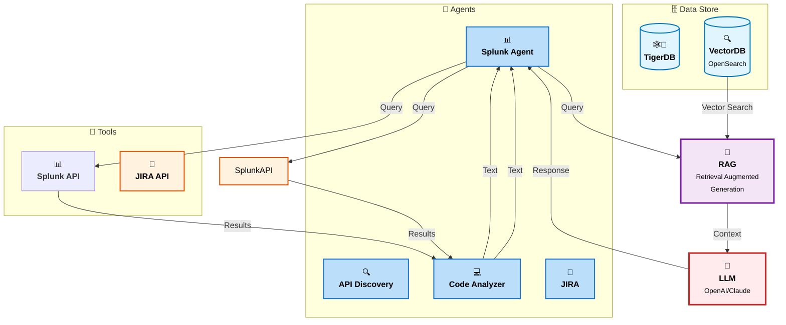

# ETL Pipelines

Standalone ETL (Extract, Transform, Load) scripts for code repository indexing, chunking, and graph generation. These scripts are **completely self-contained** and can run independently without the main backend application.

## Overview

This directory contains standalone scripts for:
- **Repository Indexing**: Parse code repositories and generate chunks with embeddings
- **Graph Building**: Create knowledge graphs from code chunks
- **Query & Reporting**: Query indexed chunks and generate HTML reports

##Selector Prompt
You are a Selector Agent responsible for routing user requests
to the most appropriate specialized agent.

Available agents:

1. SplunkAgent
   - Capabilities:
     • Search, filter, and analyze logs, metrics, traces, and alerts
     • Root cause analysis using log patterns and timestamps
     • Incident investigation and anomaly detection
     • Queries over indexed observability data (Splunk SPL)
   - Input domain:
     • Logs, errors, alerts, incidents, metrics, runtime failures

2. ApiDiscoveryAgent
   - Capabilities:
     • Discover APIs, endpoints, schemas, and dependencies
     • Analyze REST / GraphQL contracts, OpenAPI specs
     • Identify service-to-service communication
     • Detect API changes, versions, and ownership
   - Input domain:
     • APIs, endpoints, contracts, service interfaces, schemas

Routing instructions:
- Choose exactly ONE agent.
- Base your decision on the user’s intent, not keywords alone.
- If the request is primarily about runtime behavior, failures,
  incidents, logs, or system health → choose SplunkAgent.
- If the request is primarily about API structure, discovery,
  contracts, endpoints, or service interaction → choose ApiDiscoveryAgent.
- If both appear relevant, select the agent required for the FIRST
  investigative step.

Output format (strict):
{
  "selected_agent": "<SplunkAgent | ApiDiscoveryAgent>",
  "reason": "<one concise sentence explaining why>"
}


## System Architecture

### Simple System Architecture

The following diagram shows a simplified view of the core system architecture with agents, data stores, tools, and LLM integration:



### Detailed System Architecture

The following diagram illustrates the complete architecture of the ETL pipeline system, including data stores, agents, search mechanisms, and the overall reasoning layer:

```mermaid
flowchart TB
    %% User Interface Layer - Top
    User[👤<br/><b>User Input</b><br/><small>Query & Context</small>]
    User -->|Query Intent| Orchestrator
    
    %% Orchestrator - Central Hub
    Orchestrator[🎯<br/><b>Orchestrator Agent</b><br/><small>Intelligent Routing</small>]
    
    %% Agents - Single Layer
    subgraph Agents["🤖 Specialized Agents"]
        direction TB
        API[🔍<br/><b>API Discovery</b><br/><small>RAG Search</small>]
        Splunk[📊<br/><b>Splunk Agent</b><br/><small>Log Analysis</small>]
        CodeAnalyzer[💻<br/><b>Code Analyzer</b><br/><small>Code Intelligence</small>]
        JIRA[🎫<br/><b>JIRA Agent</b><br/><small>Issue Tracking</small>]
        SNOW[❄️<br/><b>SNOW Agent</b><br/><small>ITSM</small>]
    end
    
    %% Orchestrator Routes
    Orchestrator --> Agents
    
    %% Search Mechanisms
    subgraph SearchLayer["🔍 Search & Retrieval Layer"]
        direction LR
        RAG1[🔎<br/><b>RAG Search</b><br/><small>Semantic Similarity</small>]
        RAG2[🔎<br/><b>RAG Search</b><br/><small>Code Context</small>]
        GraphSearch[🕸️<br/><b>Graph Search</b><br/><small>Relationships</small>]
        SplunkQuery[🔍<br/><b>Splunk Query</b><br/><small>Log Retrieval</small>]
        JIRAMetrics[📈<br/><b>JIRA Metrics</b><br/><small>Issue Data</small>]
        SNOWMetrics[📈<br/><b>SNOW Metrics</b><br/><small>Ticket Data</small>]
    end
    
    %% Agent to Search Connections
    API --> RAG1
    Splunk --> SplunkQuery
    CodeAnalyzer --> RAG2
    CodeAnalyzer --> GraphSearch
    JIRA --> JIRAMetrics
    SNOW --> SNOWMetrics
    
    %% Data Stores - Bottom Layer
    subgraph DataStores["🗄️ Data Stores"]
        direction LR
        VectorDB[(🔍<br/><b>VectorDB</b><br/><small>OpenSearch<br/>Vector + Metadata</small>)]
        GraphDB[(🕸️🐅<br/><b>TigerDB</b><br/><small>Graph Database<br/>NetworkX</small>)]
        SplunkStore[(📊<br/><b>Splunk</b><br/><small>Logs & Metrics</small>)]
        JIRAStore[(🎫<br/><b>JIRA</b><br/><small>Issues & Metrics</small>)]
        SNOWStore[(❄️<br/><b>ServiceNow</b><br/><small>Tickets & Metrics</small>)]
    end
    
    %% Search to Data Store Connections
    RAG1 --> VectorDB
    RAG2 --> VectorDB
    GraphSearch --> GraphDB
    SplunkQuery --> SplunkStore
    JIRAMetrics --> JIRAStore
    SNOWMetrics --> SNOWStore
    
    %% Data Layer - Processing
    subgraph DataLayer["📦 Data Processing Layer"]
        direction LR
        Embeddings[📊<br/><b>Embeddings</b><br/><small>Vector Representations</small>]
        Chunks[📄<br/><b>Code Chunks</b><br/><small>Methods, Classes</small>]
        GraphData[🕸️<br/><b>Graph Data</b><br/><small>Relationships</small>]
    end
    
    %% ETL Pipeline - Left Side
    subgraph ETLPipeline["🔄 ETL Pipeline"]
        direction TB
        Parser[📝<br/><b>Code Parser</b><br/><small>AST Extraction</small>]
        Chunker[✂️<br/><b>Chunking Engine</b><br/><small>Strategy-based</small>]
        Embedder[🧮<br/><b>Embedding Generator</b><br/><small>Azure/OpenAI</small>]
        GraphBuilder[🕸️🐅<br/><b>Graph Builder</b><br/><small>NetworkX/TigerDB</small>]
        
        Parser --> Chunker
        Chunker --> Embedder
        Chunker --> GraphBuilder
    end
    
    %% ETL to Data Layer
    Embedder --> Embeddings
    Chunker --> Chunks
    GraphBuilder --> GraphData
    
    %% Data Layer to Data Stores
    Embeddings --> VectorDB
    Chunks --> VectorDB
    GraphData --> GraphDB
    
    %% RAG Component - Central
    RAG[🔎<br/><b>RAG</b><br/><small>Retrieval Augmented<br/>Generation</small>]
    
    %% LLM Reasoning - Right
    LLM[🧠<br/><b>LLM</b><br/><small>OpenAI/Claude<br/>Synthesis & Analysis</small>]
    
    %% RAG Connections
    VectorDB -->|Vector Search| RAG
    SplunkAgent -->|Query| RAG
    
    %% Search Results to RAG and LLM
    RAG1 --> RAG
    RAG2 --> RAG
    RAG -->|Context| LLM
    SplunkQuery -.->|Results| LLM
    GraphSearch -.->|Results| LLM
    JIRAMetrics -.->|Results| LLM
    SNOWMetrics -.->|Results| LLM
    
    %% LLM Feedback Loop
    LLM -->|Response| SplunkAgent
    
    %% Response Generation
    LLM --> Response[💬<br/><b>Response to User</b><br/><small>Formatted Output</small>]
    
    %% Context Feedback Loop
    Response -.->|Context Shared| Orchestrator
    Response -.->|Memory| LLM
    
    %% Agent Features
    subgraph AgentFeatures["🛡️ Agent Features"]
        direction TB
        Resiliency[🔄<br/><b>Resiliency</b><br/><small>Retry & Circuit Breaker</small>]
        Memory[💾<br/><b>Memory Persistence</b><br/><small>Context & History</small>]
    end
    
    %% Agent Features Connections
    Resiliency -.->|Enables| Agents
    Memory -.->|Enables| Agents
    Memory -.->|Stores| LLM
    
    %% Styling with better colors and UX
    classDef userStyle fill:#E3F2FD,stroke:#1976D2,stroke-width:3px,color:#000
    classDef orchestratorStyle fill:#C8E6C9,stroke:#388E3C,stroke-width:3px,color:#000
    classDef primaryAgentStyle fill:#BBDEFB,stroke:#1976D2,stroke-width:2px,color:#000
    classDef secondaryAgentStyle fill:#FFE0B2,stroke:#F57C00,stroke-width:2px,color:#000
    classDef searchStyle fill:#F3E5F5,stroke:#7B1FA2,stroke-width:2px,color:#000
    classDef ragStyle fill:#F3E5F5,stroke:#7B1FA2,stroke-width:3px,color:#000
    classDef toolStyle fill:#FFF3E0,stroke:#E65100,stroke-width:2px,color:#000
    classDef dataStoreStyle fill:#E1F5FE,stroke:#0277BD,stroke-width:2px,color:#000
    classDef dataLayerStyle fill:#FCE4EC,stroke:#C2185B,stroke-width:2px,color:#000
    classDef etlStyle fill:#E0F2F1,stroke:#00695C,stroke-width:2px,color:#000
    classDef llmStyle fill:#FFEBEE,stroke:#C62828,stroke-width:3px,color:#000
    classDef responseStyle fill:#FFF3E0,stroke:#E65100,stroke-width:3px,color:#000
    classDef featureStyle fill:#E8F5E9,stroke:#2E7D32,stroke-width:2px,color:#000
    
    class User userStyle
    class Orchestrator orchestratorStyle
    class API,Splunk,CodeAnalyzer,JIRA,SNOW primaryAgentStyle
    class RAG1,RAG2,GraphSearch,SplunkQuery,JIRAMetrics,SNOWMetrics searchStyle
    class RAG ragStyle
    class SplunkAPITool,JIRATool toolStyle
    class VectorDB,GraphDB,SplunkStore,JIRAStore,SNOWStore dataStoreStyle
    class Embeddings,Chunks,GraphData dataLayerStyle
    class Parser,Chunker,Embedder,GraphBuilder etlStyle
    class LLM llmStyle
    class Response responseStyle
    class Resiliency,Memory featureStyle
```



### Architecture Components

#### 🎯 Orchestrator Agent
- **Primary Function**: Routes user queries to appropriate specialized agents
- **Intelligence**: Determines which agents to invoke based on query intent
- **Context Management**: Maintains conversation context across interactions

#### 🔍 Specialized Agents

- **API Discovery Agent**: Discovers and documents APIs using RAG similarity search
- **Splunk Agent**: Generates Splunk queries and processes log/metric results
- **Code Analyzer Agent**: Analyzes code using both RAG and graph search
- **JIRA Agent**: Retrieves JIRA issues and metrics
- **SNOW Agent**: Retrieves ServiceNow tickets and metrics

#### 🗄️ Data Stores

- **OpenSearch**: Vector embeddings + metadata for semantic search
- **Graph Database (TigerDB/NetworkX)**: Code relationships and entity graphs
- **Splunk**: Logs, metrics, and observability data
- **JIRA**: Issue tracking and project metrics
- **ServiceNow**: IT service management and tickets

#### 📦 Data Layer

- **Embeddings**: Vector representations of code chunks (Azure OpenAI/OpenAI)
- **Code Chunks**: Parsed methods, classes, and files with metadata
- **Graph Data**: Entity relationships, dependencies, and call graphs
- **Configuration**: Application settings, secrets, and metadata

#### 🔄 ETL Pipeline

- **Code Parser**: AST extraction using TreeSitter/javalang
- **Chunking Engine**: Strategy-based code chunking (method, class, hybrid)
- **Embedding Generator**: Batch embedding generation (Azure/OpenAI)
- **Graph Builder**: NetworkX graph construction and TigerDB porting

#### 🤖 LLM Reasoning Layer

- **Synthesis**: Combines results from multiple agents and search mechanisms
- **Analysis**: Provides comprehensive reasoning across all data sources
- **Response Generation**: Formats output for user consumption
- **Memory Integration**: Leverages persistent agent memory for context-aware responses

#### 🛡️ Agent Features

- **Resiliency**: 
  - Retry mechanisms with exponential backoff
  - Circuit breaker patterns for fault tolerance
  - Graceful degradation on failures
  - Health checks and monitoring
  
- **Memory Persistence**:
  - Conversation context retention across sessions
  - Agent state management and recovery
  - Long-term memory for user preferences
  - Integration with LLM for context-aware reasoning

## Project Structure

```
etl_pipelines/
├── README.md                          # This file
├── requirements.txt                   # Python dependencies
├── ADVANCED_ETL_FEATURES.md          # Advanced features guide
├── .gitignore                         # Git ignore rules
└── scripts/                           # ETL scripts
    ├── __init__.py
    ├── standalone_build_repo_independent.py      # Repository indexing
    ├── standalone_query_to_html_independent.py   # Query & HTML reports
    ├── visualize_graph_3d.py                     # 3D graph visualization
    ├── generate_architecture_diagram.py          # Architecture diagram generator
    └── standalone_xml_parser.py                   # XML data/rules file parser
```

## Scripts

### 1. `standalone_build_repo_independent.py`

**Purpose**: Parse repositories and generate chunks with optional embeddings and graph building.

**Features**:
- Parse code repositories (Java, Python, JavaScript/TypeScript, Go, Rust)
- Generate chunks using configurable strategies
- **Progress bars** (tqdm) for long-running operations
- **Batch embedding generation** for efficient API usage
- **Parallel file processing** (joblib) for faster indexing
- **Data validation** (pydantic) for chunk quality
- **Statistics and analytics** (pandas) for insights
- **Checkpointing** to resume interrupted processing
- Generate embeddings (optional, requires OpenAI API key)
- Index to OpenSearch (optional)
- Build NetworkX knowledge graphs (always generated and saved as `.pkl` file)
- Port graphs to TigerDB/TigerGraph (optional, requires `pyTigerGraph`)
- **Automatic TigerDB porting**: When Azure embeddings are enabled and TigerGraph host is provided, graph is automatically ported
- Single file mode: Generate chunks as JSON without indexing

### 2. `standalone_query_to_html_independent.py`

**Purpose**: Query OpenSearch chunks and generate HTML reports with Mermaid graphs.

**Features**:
- Query OpenSearch index
- Generate HTML reports with search results
- Include Mermaid graph visualizations
- No database or backend required

### 3. `visualize_graph_3d.py`

**Purpose**: Create interactive 3D visualizations of NetworkX knowledge graphs.

**Features**:
- Interactive 3D graph visualization using Plotly
- Color-coded nodes by entity type (rich schema)
- Hover tooltips with node information
- HTML export for sharing
- Performance optimization for large graphs (node limiting)
- Z-axis based on entity type hierarchy
- Create sample graphs for testing

**Usage**:

```bash
# Visualize an existing graph
python visualize_graph_3d.py \
  --graph-file ./output/graph.pkl \
  --output graph_3d.html \
  --max-nodes 500

# Create a sample graph for testing
python visualize_graph_3d.py --create-sample

# Visualize the sample graph
python visualize_graph_3d.py \
  --graph-file sample_graph.pkl \
  --output sample_graph_3d.html
```

**Arguments**:
- `--graph-file` - Path to graph pickle file (required, unless `--create-sample`)
- `--output` - Output HTML file (default: `graph_3d.html`)
- `--max-nodes` - Maximum nodes to visualize (default: 500, for performance)
- `--layout-iterations` - Layout calculation iterations (default: 50)
- `--create-sample` - Create a sample graph for testing
- `--sample-file` - Sample graph file path (default: `sample_graph.pkl`)

### 4. `generate_architecture_diagram.py`

**Purpose**: Generate a high-quality visual architecture diagram as an image file.

**Features**:
- Professional architecture diagram with icons and color coding
- High-resolution output (PNG, SVG, PDF formats)
- Modern, accessible color palette
- Clear visual hierarchy and flow
- Legend and labels for easy understanding
- Customizable output format and resolution

**Usage**:

```bash
# Generate PNG image (default, 300 DPI)
python generate_architecture_diagram.py --output architecture.png

# Generate high-resolution PNG
python generate_architecture_diagram.py --output architecture.png --dpi 600

# Generate SVG (vector format, scalable)
python generate_architecture_diagram.py --output architecture.svg --format svg

# Generate PDF (for documentation)
python generate_architecture_diagram.py --output architecture.pdf --format pdf

# Display the diagram after generation
python generate_architecture_diagram.py --output architecture.png --show
```

**Arguments**:
- `--output` - Output file path (default: `architecture.png`)
- `--format` - Output format: `png`, `svg`, or `pdf` (default: `png`)
- `--dpi` - Resolution for raster formats (default: 300)
- `--show` - Display the diagram after generation

**Requirements**:
- `matplotlib` - For diagram generation
- Optional: `networkx` - For advanced layout algorithms

### 5. `standalone_xml_parser.py`

**Purpose**: Parse XML data and rules files from repositories, extract meaningful chunks, and optionally generate embeddings and index to OpenSearch.

**Features**:
- Discovers XML files in repository (excludes build/config files like `pom.xml`, `web.xml`)
- Classifies XML files as `data`, `rules`, or `generic`
- Extracts chunks based on XML type:
  - **Rules files**: Extracts individual rules with metadata (name, type, ID, description)
  - **Data files**: Extracts data elements (records, items, entries)
  - **Generic files**: Chunks by size with overlap
- Generates unique chunk IDs and content hashes
- Optional OpenAI embeddings for semantic search
- Optional OpenSearch indexing with XML-specific mapping
- Progress bars for long-running operations
- Statistics and reporting

**Usage**:

```bash
# Basic parsing (save to JSON only)
python standalone_xml_parser.py \
  --repo-path /path/to/repo \
  --output-dir ./xml_output

# With embeddings
python standalone_xml_parser.py \
  --repo-path /path/to/repo \
  --output-dir ./xml_output \
  --openai-api-key sk-... \
  --embedding-model text-embedding-3-small

# With OpenSearch indexing
python standalone_xml_parser.py \
  --repo-path /path/to/repo \
  --output-dir ./xml_output \
  --opensearch-host https://your-opensearch-host \
  --opensearch-index xml-chunks \
  --use-aws-auth \
  --aws-region us-east-1

# Exclude specific XML patterns
python standalone_xml_parser.py \
  --repo-path /path/to/repo \
  --exclude-patterns config.xml schema.xml
```

**Arguments**:
- `--repo-path` - Path to repository root (required)
- `--output-dir` - Output directory for chunks JSON (default: `./xml_output`)
- `--max-chunk-size` - Maximum chunk size in characters (default: 2000)
- `--chunk-overlap` - Chunk overlap size (default: 200)
- `--exclude-patterns` - Additional XML file patterns to exclude
- `--openai-api-key` - OpenAI API key for embeddings
- `--embedding-model` - Embedding model (default: `text-embedding-3-small`)
- `--no-embeddings` - Skip embedding generation
- `--opensearch-host` - OpenSearch host URL
- `--opensearch-index` - OpenSearch index name (default: `xml-chunks`)
- `--use-aws-auth` - Use AWS authentication for OpenSearch
- `--aws-region` - AWS region for authentication (default: `us-east-1`)
- `--no-verify-certs` - Disable SSL certificate verification

**Output Format**:

The script generates a JSON file (`xml_chunks.json`) with:
- Repository metadata
- Statistics (file counts by XML type)
- All chunks with metadata:
  - `type`: `xml_rule`, `xml_data`, or `xml_generic`
  - `xml_type`: `rules`, `data`, or `generic`
  - `rule_name`, `rule_type`, `rule_id` (for rules)
  - `element_name`, `element_id` (for data)
  - `file_path`, `start_line`, `end_line`
  - `code`, `summary`, `description`
  - `chunk_id`, `_id`, `embedding` (if generated)

**OpenSearch Mapping**:

The script creates an index with XML-specific fields:
- `xml_type`: Classification (`rules`, `data`, `generic`)
- `rule_name`, `rule_type`, `rule_id`: Rule metadata
- `element_name`, `element_id`: Data element metadata
- `embedding`: Vector embeddings for semantic search
- Standard fields: `chunk_id`, `file_path`, `code`, `summary`, etc.

**Querying XML Chunks**:

```python
# Query for rules
query = {
    "query": {
        "bool": {
            "must": [
                {"match": {"code": "your search term"}},
                {"term": {"xml_type": "rules"}}
            ]
        }
    }
}

# Query for specific rule type
query = {
    "query": {
        "bool": {
            "must": [
                {"term": {"xml_type": "rules"}},
                {"term": {"rule_type": "validation"}}
            ]
        }
    }
}
```

**3D Visualization in Build Script**:

You can also generate 3D visualizations directly when building the repository:

```bash
python standalone_build_repo_independent.py \
  --repo-path /path/to/repo \
  --output-dir ./output \
  --visualize-3d \
  --max-nodes-3d 500
```

## Installation

### Quick Start

```bash
cd etl_pipelines
pip install -r requirements.txt
```

### Verify Installation

```bash
python -c "
import tree_sitter
import tree_sitter_python
import tree_sitter_java
import tree_sitter_javascript
import networkx
print('✅ Core libraries installed')
"
```

## Usage

### 1. Build Repository Index

#### Single File Mode (No OpenSearch/embeddings needed)

Generate chunks as JSON for a single file:

```bash
cd etl_pipelines/scripts

python standalone_build_repo_independent.py \
  --file /path/to/file.java \
  --output chunks.json \
  --chunking-strategy class_metadata
```

#### Full Repository Mode

Index entire repository with optional embeddings and OpenSearch:

```bash
cd etl_pipelines/scripts

python standalone_build_repo_independent.py \
  --repo-path /path/to/repository \
  --output-dir ./output \
  --opensearch-host localhost:9200 \
  --opensearch-index code_chunks \
  --openai-api-key sk-... \
  --chunking-strategy class_metadata
```

#### AWS OpenSearch with Authentication

For AWS OpenSearch, you can use either command-line arguments or a config file:

**Using Command-Line Arguments:**
```bash
python standalone_build_repo_independent.py \
  --repo-path /path/to/repository \
  --output-dir ./output \
  --opensearch-host search-domain.us-east-1.es.amazonaws.com \
  --opensearch-index code_chunks \
  --opensearch-region us-east-1 \
  --opensearch-use-aws-auth \
  --openai-api-key sk-...
```

**Using Config File (config.ini):**
```bash
python standalone_build_repo_independent.py \
  --repo-path /path/to/repository \
  --output-dir ./output \
  --opensearch-config /path/to/config.ini \
  --opensearch-use-aws-auth \
  --openai-api-key sk-...
```

**Config File Format (config.ini):**
```ini
[aws_info]
opensearch_endpoint = search-domain.us-east-1.es.amazonaws.com
index_name = code_chunks
region = us-east-1
```

**Note**: For AWS authentication, ensure you have:
- AWS credentials configured (via `~/.aws/credentials`, environment variables, or IAM role)
- `aws-requests-auth` and `boto3` installed: `pip install aws-requests-auth boto3`

**Arguments**:
- `--file` - Path to single file (single file mode)
- `--output` - Output JSON file (single file mode, default: `chunks.json`)
- `--repo-path` - Repository path (full repository mode)
- `--output-dir` - Output directory (full repository mode, default: `./output`)
- `--opensearch-host` - OpenSearch host/endpoint (optional, e.g., `localhost:9200` or `search-domain.us-east-1.es.amazonaws.com`)
- `--opensearch-index` - OpenSearch index name (optional, default: `code_chunks`)
- `--opensearch-config` - Path to config.ini file for OpenSearch configuration (optional)
- `--opensearch-use-aws-auth` - Use AWS authentication for OpenSearch (default: True)
- `--opensearch-no-aws-auth` - Disable AWS authentication (use basic auth for local dev)
- `--opensearch-region` - AWS region for OpenSearch (default: `us-east-1`)
- `--opensearch-use-ssl` - Use SSL for OpenSearch connection (default: True)
- `--opensearch-verify-certs` - Verify SSL certificates (default: True)
- `--openai-api-key` - OpenAI API key for embeddings (optional)
- `--embedding-model` - Embedding model (optional, default: `text-embedding-3-small`)
- `--chunking-strategy` - Chunking strategy (default: `class_metadata`)
- `--max-chunk-size` - Maximum chunk size in characters (default: `1000`)
- `--enforce-chunk-size` - Enforce chunk size limits (default: `True`)
- `--chunk-overlap-size` - Overlap size for sliding_window strategy (default: `50`)
- `--batch-size` - Batch size for embedding generation (default: `100`)
- `--n-jobs` - Number of parallel jobs for file processing (-1 = all CPUs, default: `-1`)
- `--checkpoint-file` - Checkpoint file path for resuming (optional)
- `--resume` - Resume from checkpoint if available
- `--use-azure-embeddings` - Use Azure OpenAI Embeddings service (requires config.ini)
- `--user-sid` - User session ID for Azure embeddings (default: `default_user`)
- `--azure-cert-path` - Path to Azure certificate file (.pem)
- `--azure-config-path` - Path to config.ini file (default: script directory)
- `--tigergraph-host` - TigerGraph host (e.g., `https://your-instance.i.tgcloud.io`)
- `--tigergraph-graphname` - TigerGraph graph name (default: `code_knowledge_graph`)
- `--tigergraph-username` - TigerGraph username (default: `tigergraph`)
- `--tigergraph-password` - TigerGraph password
- `--tigergraph-secret` - TigerGraph secret (for cloud instances)
- `--port-to-tigergraph` - Port NetworkX graph to TigerDB after building
- `--port-graph-file` - Port existing NetworkX graph file to TigerDB (standalone operation)

#### File Discovery and Test Directory Exclusion

By default, the script automatically excludes test directories from being chunked and embedded. The following directories are excluded:

**Build and Dependency Directories:**
- `.git` - Git repository metadata
- `node_modules` - Node.js dependencies
- `target` - Maven build output
- `build` - Build artifacts
- `__pycache__` - Python cache
- `.venv` - Python virtual environment

**Test Directories:**
- `test` - Standard test directory (Maven, Python)
- `tests` - Alternative test directory (Python, Node.js)
- `__tests__` - Node.js/React test directory
- `spec` - Ruby/JavaScript spec directory
- `test/java` - Maven Java test source
- `test/resources` - Maven test resources
- `src/test` - Maven standard test source
- `src/test/java` - Maven Java test source
- `src/test/resources` - Maven test resources

**How It Works:**
The script checks if any part of a file's path contains an excluded directory name. For example:
- `src/main/java/UserService.java` ✅ **Included**
- `src/test/java/UserServiceTest.java` ❌ **Excluded** (contains `test`)
- `tests/unit/helper.py` ❌ **Excluded** (contains `tests`)

This ensures that only production code is indexed, reducing noise and improving search relevance.

### 2. Query to HTML Report

Query OpenSearch and generate HTML report:

```bash
cd etl_pipelines/scripts

python standalone_query_to_html_independent.py \
  --query "getUser method" \
  --opensearch-host localhost:9200 \
  --opensearch-index code_chunks \
  --output-file report.html \
  --top-k 10
```

**Arguments**:
- `--query` - Search query string (required)
- `--opensearch-host` - OpenSearch host (required, e.g., `localhost:9200`)
- `--opensearch-index` - OpenSearch index name (required)
- `--output-file` - Output HTML file (default: `query_report.html`)
- `--top-k` - Number of top results (default: `10`)
- `--include-code` - Include code snippets in report (default: `true`)
- `--include-embeddings` - Include embedding vectors (default: `false`)

### 3. Inspect Graph Nodes/Edges for a File

```bash
cd etl_pipelines/scripts

python graph_inspect.py \
  --graph-file ./output/graph.pkl \
  --file-path src/main/java/com/acme/UserService.java \
  --max-neighbors 20
```
Shows the graph nodes tied to the given `file_path` and their neighboring nodes/edges (limited by `--max-neighbors`). Requires `networkx`.

## Chunking Strategies

Available strategies:

1. **`method_only`** - Only method-level chunks (smallest, best precision)
2. **`class_metadata`** - Method chunks + class metadata (recommended)
3. **`recursive`** - Recursively splits large methods/classes
4. **`sliding_window`** - Overlapping windows for large classes
5. **`hybrid`** - Method + class metadata + file chunks

See `../backend/CHUNKING_STRATEGIES.md` for detailed comparison.

## Dependencies

### Core Dependencies (Required)

- `tree-sitter` - Multi-language code parsing
- `tree-sitter-python` - Python parsing
- `tree-sitter-java` - Java parsing
- `tree-sitter-javascript` - JavaScript/TypeScript parsing
- `tree-sitter-go` - Go parsing
- `tree-sitter-rust` - Rust parsing
- `networkx` - Graph operations

### Advanced ETL Features (Phase 1 & 2 - Recommended)

- `tqdm` - Progress bars for long-running operations
- `joblib` - Parallel file processing (2-10x faster for large repos)
- `pydantic` - Data validation for chunks
- `pandas` - Statistics and analytics

### Optional Dependencies

- `openai` - For generating embeddings (optional)
- `opensearch-py` - For OpenSearch indexing/querying (optional)
- `plotly` - For 3D graph visualization (optional, install: `pip install plotly`)

## Output Files

### Repository Indexing

- **`chunks.json`** - Generated chunks with metadata
- **`graph.pkl`** - NetworkX graph (pickle format)

### Query Reports

- **`report.html`** - HTML report with Mermaid graphs

## Environment Variables

```bash
export OPENAI_API_KEY=sk-...  # For embeddings
export OPENSEARCH_HOST=localhost:9200  # For OpenSearch
```

## Examples

### Example 1: Generate Chunks for Single File

```bash
cd etl_pipelines/scripts

python standalone_build_repo_independent.py \
  --file ./UserService.java \
  --output user_service_chunks.json \
  --chunking-strategy class_metadata \
  --max-chunk-size 1000
```

### Example 2: Index Full Repository

```bash
cd etl_pipelines/scripts

python standalone_build_repo_independent.py \
  --repo-path ~/projects/my-java-app \
  --output-dir ./my-app-index \
  --opensearch-host localhost:9200 \
  --opensearch-index my_app_chunks \
  --openai-api-key sk-... \
  --chunking-strategy class_metadata
```

### Example 3: Query and Generate Report

```bash
cd etl_pipelines/scripts

python standalone_query_to_html_independent.py \
  --query "authentication method" \
  --opensearch-host localhost:9200 \
  --opensearch-index my_app_chunks \
  --output-file auth_report.html \
  --top-k 10
```

### Example 4: Complete Workflow

```bash
# Step 1: Index repository
cd etl_pipelines/scripts
python standalone_build_repo_independent.py \
  --repo-path ~/projects/my-app \
  --output-dir ./my-app-index \
  --opensearch-host localhost:9200 \
  --opensearch-index my_app_chunks \
  --openai-api-key sk-... \
  --chunking-strategy class_metadata \
  --batch-size 100 \
  --n-jobs -1 \
  --resume

# Step 2: Query and generate report
python standalone_query_to_html_independent.py \
  --query "getUser method" \
  --opensearch-host localhost:9200 \
  --opensearch-index my_app_chunks \
  --output-file report.html
```

### Example 5: Resume Interrupted Processing

```bash
# If processing is interrupted, resume from checkpoint
python standalone_build_repo_independent.py \
  --repo-path ~/projects/my-app \
  --output-dir ./my-app-index \
  --checkpoint-file ./my-app-index/checkpoint.json \
  --resume \
  --openai-api-key sk-...
```

### Example 6: Parallel Processing for Large Repository

```bash
# Use all CPU cores for faster processing
python standalone_build_repo_independent.py \
  --repo-path ~/projects/large-app \
  --output-dir ./large-app-index \
  --n-jobs -1 \
  --batch-size 200 \
  --openai-api-key sk-...
```

## Troubleshooting

### Issue: "TreeSitter not available"

```bash
pip install tree-sitter tree-sitter-python tree-sitter-java tree-sitter-javascript
```

### Issue: "OpenSearch connection failed"

1. Verify OpenSearch is running:
   ```bash
   curl http://localhost:9200
   ```

2. Check host format (no protocol):
   ```bash
   --opensearch-host localhost:9200  # Correct
   --opensearch-host http://localhost:9200  # Wrong
   ```

### Issue: "No chunks generated"

**Possible Causes**:
1. Repository path is incorrect
2. No code files found (check file extensions)
3. Parser failed to parse files

**Solution**:
```bash
# Verify repository path
ls /path/to/repository

# Check for code files
find /path/to/repository -name "*.java" -o -name "*.py" | head -10
```

### Issue: "OpenAI API key not provided"

Embeddings are optional. If you don't need embeddings, simply omit the `--openai-api-key` argument. Chunks will be generated without embeddings.

## Advanced ETL Features

The scripts now include advanced ETL features for improved performance and user experience:

### Phase 1: Quick Wins (Implemented)

✅ **tqdm** - Progress bars for file processing and embedding generation
- Visual progress indicators
- ETA (estimated time remaining)
- Processing speed metrics

✅ **Batch Embedding Generation** - Efficient API usage
- Processes embeddings in batches (default: 100)
- Reduces API rate limit issues
- Faster overall processing

✅ **Basic Checkpointing** - Resume interrupted processing
- Saves progress periodically
- Resume from checkpoint with `--resume` flag
- Prevents data loss on interruption

### Phase 2: Performance Improvements (Implemented)

✅ **joblib** - Parallel file processing
- Processes multiple files simultaneously
- Configurable number of parallel jobs (`--n-jobs`)
- 2-10x faster for large repositories

✅ **pydantic** - Data validation
- Validates chunk structure and types
- Ensures data quality
- Better error messages

✅ **pandas** - Statistics and analytics
- Chunk size distribution
- Language distribution
- File-level statistics
- Data quality metrics

### Usage

All advanced features are enabled by default when dependencies are installed:

```bash
# Install all advanced features
pip install -r requirements.txt

# Features are automatically used:
# - Progress bars (tqdm)
# - Parallel processing (joblib)
# - Data validation (pydantic)
# - Statistics (pandas)
# - Batch embeddings (built-in)
# - Checkpointing (built-in)
```

### Configuration

```bash
# Adjust batch size for embeddings
--batch-size 200  # Larger batches for faster processing

# Control parallel processing
--n-jobs 4  # Use 4 CPU cores
--n-jobs -1  # Use all available CPUs (default)

# Enable checkpointing
--checkpoint-file ./checkpoint.json
--resume  # Resume from checkpoint
```

See `ADVANCED_ETL_FEATURES.md` for detailed implementation guide.

## Documentation

For detailed documentation, see:
- `ADVANCED_ETL_FEATURES.md` - Advanced ETL libraries and features guide
- `../backend/STANDALONE_SCRIPTS_GUIDE.md` - Comprehensive execution guide (updated paths)
- `../backend/CHUNKING_STRATEGIES.md` - Chunking strategy details
- `../backend/CHUNKING_QUICK_REFERENCE.md` - Quick reference

## License

Same as parent project.
